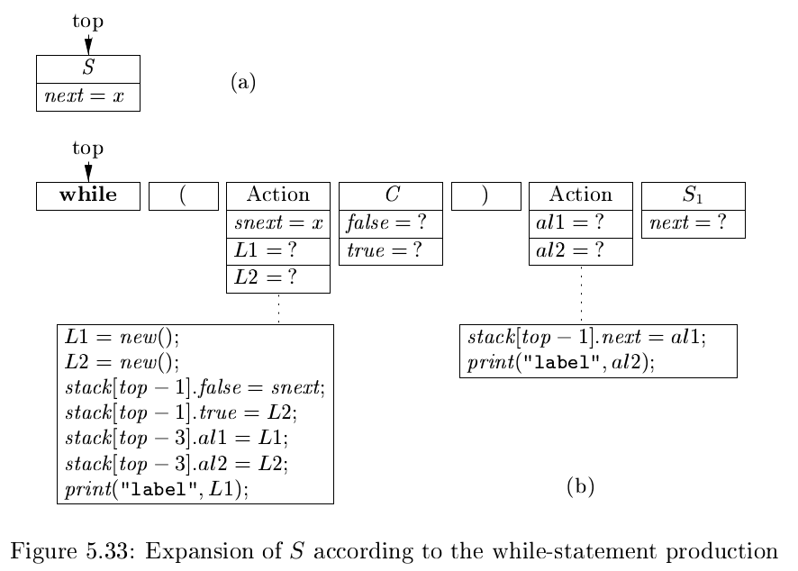
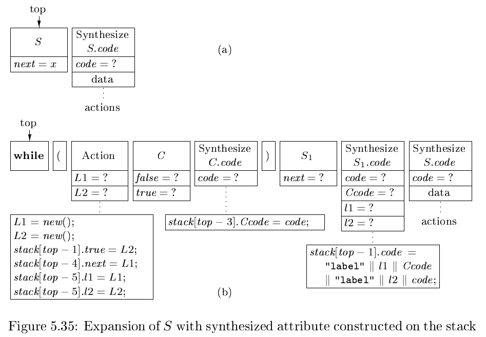
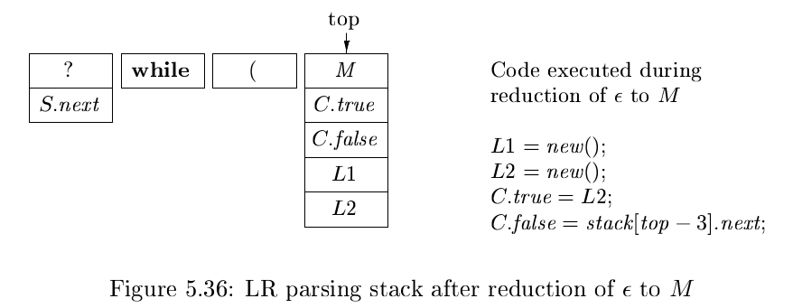
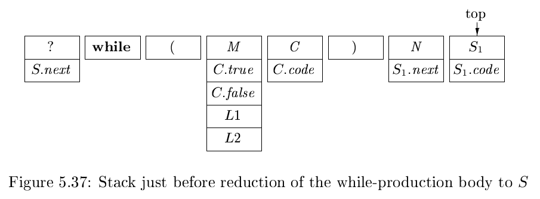

# 《编译原理》 day 38

今天是读《编译原理》的逻辑第 38 天，继续学习实现 SDT，这次用栈。

首先是 LL 方法，根据之前的学习，栈存放的是文法符号，每当使用产生式展开，就把产生式右侧的文法符号从右往左压入栈，并弹出第一个元素。

实现 SDT 的方式是在栈中额外存放 action-records（动作记录）和 synthesize-records（综合记录），其中动作记录在对应文法符号上方，综合记录在下方。

再拿文法 S -> while(C) S1 为例，它的执行过程是这样的



初始状态如图 a，此时只有 next 属性，S 弹出后使用产生式展开，压入右侧文法符号，额外压入两个动作记录，一个是文法符号 C 前面嵌入的语义动作，另一个是 S1 前面的语义动作。

动作记录执行指令类似语义动作，创建 L1，L2 然赋值 C 的属性，再赋值另一个动作记录的属性，最后打印 label L1，另一个动作记录赋值 S1 的属性，打印 label L2。

继续弹出元素到 S1，这时和最开始的情况一样，继续下一轮。

不出意外的，它又演示了一把带综合属性的 LL 方法



比较有意思的是 S 虽然最早被弹出了，但 S 的综合属性却是最后被弹出的，那是不是意味着后面有一排排的综合属性等着弹出。

然后是 LR 方法，简单总结，没看懂。

能用 LL 实现的 L 属性 SDD 都能用 LR 实现，这里感觉有点迷，既然能用 LL 实现了，为啥还要用 LR 实现。

转化需要的三个调整

1. L 属性 SDD 调整为 SDT
2. 引入特殊的非终结符 M 代替语义动作，产生式 M -> ε
3. 调整 A -> α{a}β 的语义动作 a，生成新的语义动作 a' 关联到 M
   1. 拷贝语义动作 a 用得上的 A，α 属性当做 M 的继承属性
   2. 计算语义动作 a 得到的属性当做 M 的综合属性

千言万语不如一句代码。

产生式

```
A -> {B.i = f(A.i);} B C
```

调整为

```
A -> M B C
M -> {M.i = A.i; M.s = f(A.i)}
```

这个转换似乎是为了强行让语义动作出现在产生式最右端。

再再拿 S -> while(C) S1 为例，调整后

```
S -> while (M C) N S1
M -> {
        L1 = new(); 
        L2 = new(); 
        C.true = L2; 
        C.false = stack[top - 3].next;
     }
N -> {
        S1.next = stack[top - 3].L1;
     }
```





封面图：Twitter 心臓弱眞君 @xinzoruo