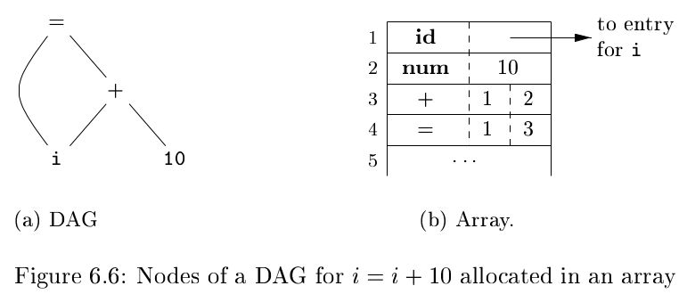
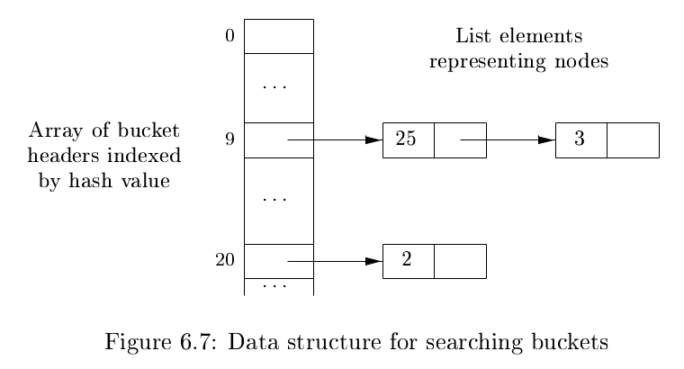
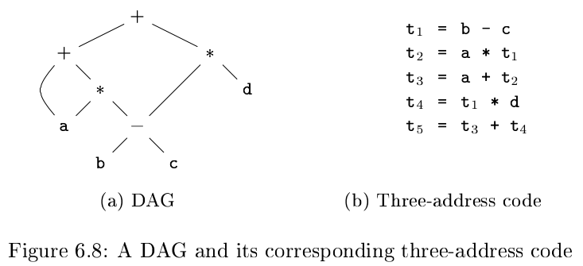

# 《编译原理》 day 40

今天是读《编译原理》的逻辑第 40 天，学习 DAG 和三地址代码。

DAG (directed acyclic graph) 中文有向无环图，是语法树变体。

它和语法树的区别是，语法树每个结点都是独立的，DAG 相同的结点算一个，相比语法树结点更少，结点可能有多个爹，那不如叫它吕布结点吧 :)

相同的结点叫公共表达式。

在语法树的基础上稍微改一下很容易生成 DAG，只要创建结点前判断一下结点是否存在

```
node = getNode(op, n1, n2);
if (node == null) {
    node = new Node(op, n1, n2);
}
```

使用记录表示 DAG，好有趣的想法



高效实现 getNode 方法，用到哈希函数，通过计算 h(op, n1, n2) 找到对应的桶，然后再尝试找到结点。



这个结构挺像某道面试题的。

三地址代码，形如 t = x + y，右侧只能有一个操作符，涉及三个地址。

表达式 a + a * (b - c) + (b - c) * d 的 DAG 和三地址表示



常见的三地址指令形式

1. x = y op z 两个操作数的运算符，大部分操作符属于这类
2. x = op y 一个操作数的运算符
3. x = y 复制指令
4. goto L 无条件跳转
5. if x goto L, ifFalse x goto L 条件跳转
6. if x relop y goto L 另一种写法的条件跳转
7. x = y[i], x[i] = y 带下标的复制指令
8. x = &y, x = *y, *x = y 死去的记忆正在攻击我

最后一种，过程调用

```
param x1
param x2
...
param xn
call p, n
```

有汇编那味儿了。

Quadruple（四元式）由四个字段组成，op, arg<sub>1</sub>, arg<sub>2</sub>, result。

Triple（三元式）由三个字段组成，op, arg<sub>1</sub>, arg<sub>2</sub> 没有 result 用值编码代替。

举个例子，表达式 a = b * -c + b * -c

对应的三地址表示

+ t<sub>1</sub> = minus c
+ t<sub>2</sub> = b * t<sub>1</sub>
+ t<sub>3</sub> = minus c
+ t<sub>4</sub> = b * t<sub>3</sub>
+ t<sub>5</sub> = t<sub>2</sub> +t<sub>4</sub>
+ a = t<sub>5</sub>

对应的四元式

|值编码|op|arg<sub>1</sub>, </br> arg<sub>2</sub>|result|
|--|--|--|--|
|0|minus|(c,)|t<sub>1</sub>|
|1|*|(b, t<sub>1</sub>)|t<sub>2</sub>
|2|minus|(c,)|t<sub>3</sub>|
|3|*|(b, t<sub>3</sub>)|t<sub>4</sub>|
|4|+|(t<sub>2</sub>, t<sub>4</sub>)|t<sub>5</sub>|
|5|=|(t<sub>5</sub>, )|a|

对应的三元式

|值编码|op|arg<sub>1</sub>|arg<sub>2</sub>|
|--|--|--|--|
|0|minus|c||
|1|*|b|(0)|
|2|minus|c|
|3|*|b|(2)|
|4|+|(2)|(4)|
|5|=|a|(4)|

三元式有个缺点，移动条目会改变值编码，进而导致所有引用的地方都要改，用另一张表维护指向三元式的指针可以规避这个问题。

|序号|指令|
|--|--|
|35|(0)|
|36|(1)|
|37|(2)|
|38|(3)|
|39|(4)|
|40|(5)|

印象里数据库的辅助索引也用过这招。

封面图：Twitter 心臓弱眞君 @xinzoruo