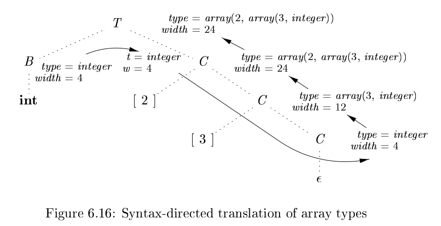

# 《编译原理》 day 41

今天是读《编译原理》的逻辑第 41 天，学习类型和声明。

类型本身有结构，用类型表达式表示，包括基本类型和使用 type constructor 组成的表达式，这玩意儿我两个版本都看了，不是很能理解。

类型表达式可以是

+ 基本类型
+ 类名
+ 形如 int[2] 这样的表达式，使用叫做 array 的 type constructor 结合另一个类型表达式和数字
+ 形如 record {int x;} 这样的表达式，这个好诡异啊，从来没见过，使用的是 record type constructor
+ 形如 s -> t 这样的表达式，表示从类型 s 到类型 t 的函数，这个也好诡异
+ 类型表达式 s，t 的笛卡尔积 s * t 是类型表达式
+ 类型表达式可以包含取值为类型表达式的变量，根本不知道它想表达什么

声明和定义的区别，int i 叫声明，i = 0 叫定义。

声明的文法

+ D -> T **id** ; D | ε
+ T -> B C | **record** '{' D '}'
+ B -> **int** | **float**
+ C -> ε | [**num**] C

局部变量名的存储布局，这东西都来了，还好只是演示计算长度。

类型表达式 int[2][3] 的类型和长度计算

这节看的有点迷，尤其这个类型表达式，可能 java 写多了，一般都管它叫 class 不叫 type。

封面图：Twitter 心臓弱眞君 @xinzoruo