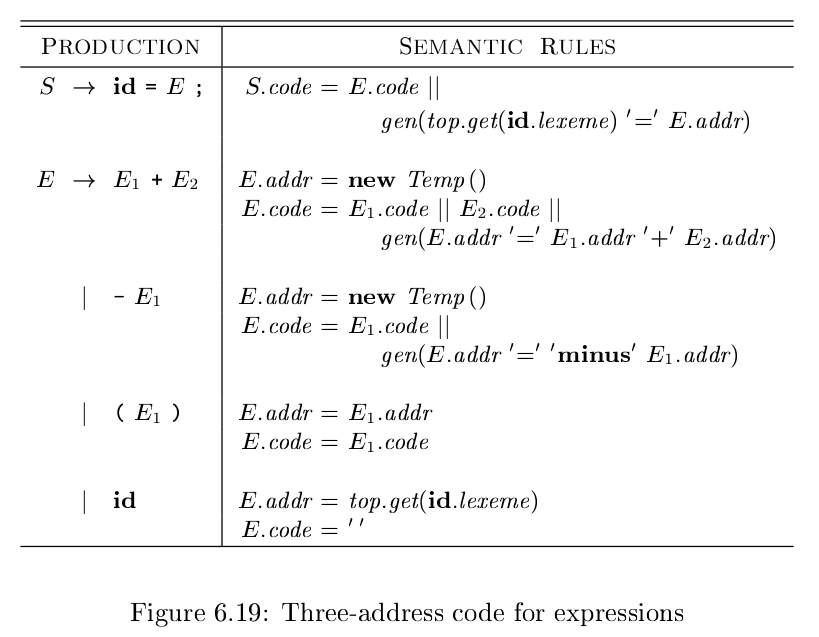
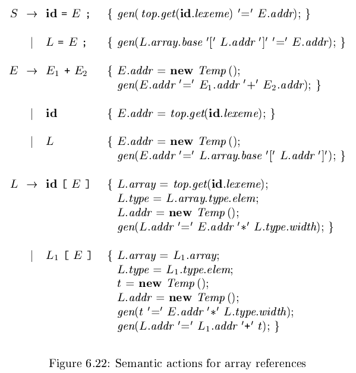
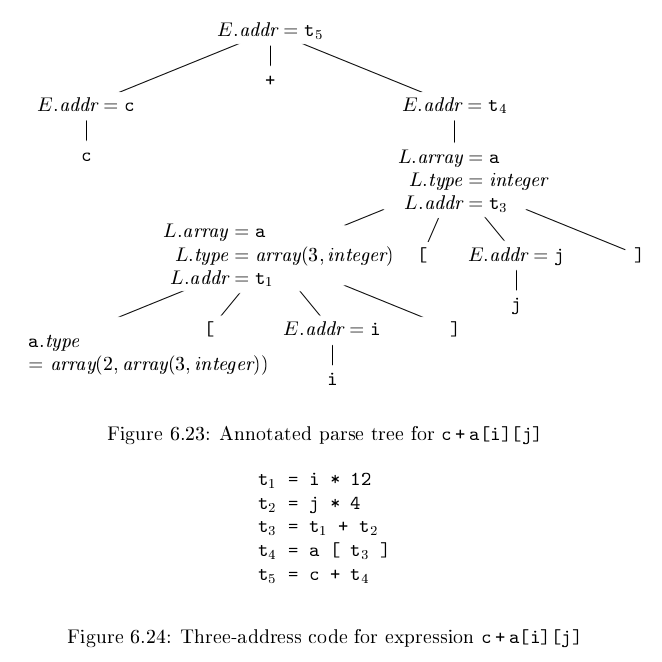

# 《编译原理》 day 42

今天是读《编译原理》的逻辑第 42 天，学习表达式翻译。

首先是普通的算数表达式，这个很好理解

top.get(**id**.lexeme) 从当前符号表取出对应条目,这个条目是词法分析的时候塞进去的。

非终结符有两个属性 addr 和 code，分别表示地址和三地址代码，gen(E.addr '=' E1.addr '+' E2.addr) 生成形如 t = a + b 这样的三地址代码

不出所料的 code 属性又被优化掉了，这次的技术叫增量翻译，估计本质差不多，就是 gen 函数把当前的三地址表达式 print 了。

数组寻址，对于元素宽度为 w 的一维数组

假设 A[0].addr = base

那么 A[i].addr = base + i * w

更通用的情况，数组下标是 low, low + 1, ... high

假设 A[low].addr = base

那么 A[i].addr = base + (i - low) * w

不知道来这么一出有什么深意。

寻址公式化简 i * w + (base - low * w) 这样的好处是少一次运算，另外 base - low * w 编译时可计算。

这个优化让我想起哪本书有道题，说是两个复数乘法可以怎么优化？

正常版本

(a + bi)(c + di) = (ac - bd) + (ad + bc)i

优化版本

+ t1 = ac
+ t2 = bd
+ t3 = (a + b) * (c + d)

(a + bi)(c + di) = (t1 - t2) + (t3 - t1 - t2)i

优化版本只有 3 次乘法，代价是加减运算多了 3 次。

多维数组，pandas 那里见过，脑子实在转不过来。

A[i1][i2]...[ik].addr = base + i1 * w1 + i2 * w2 + ... + ik * wk

数组引用翻译，巨复杂，猪脑过载

表达式 c + a[i][j] 的注释分析树和三地址代码

数组这么复杂的么。

封面图：Twitter 心臓弱眞君 @xinzoruo