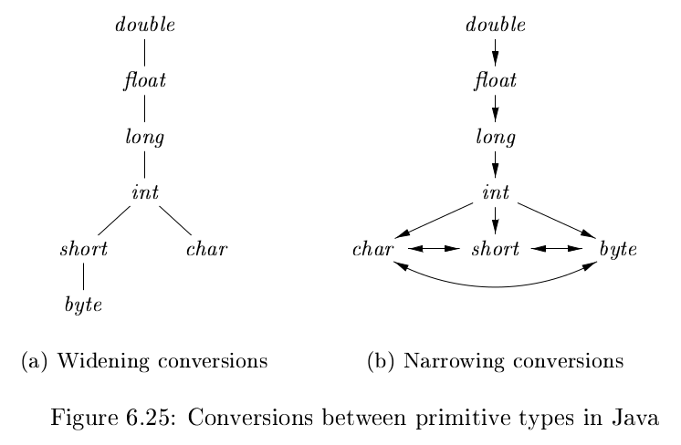
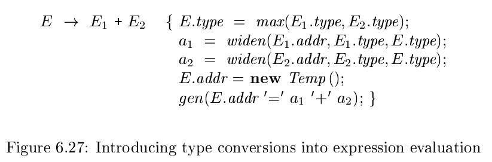

# 《编译原理》 day 43

今天是读《编译原理》的逻辑第 43 天，学习类型检查。

类型检查有两种形式：综合和推导。

类型综合，根据子表达式的类型，构造表达式的类型。

```
if f has type s -> t and x has type s,
then expression f(x) has type t
```

类型推导，根据语言结构的使用方式来确定该结构的类型。

```
if f(x) is an expression,
then for some α and β, f has type α -> β and x has type α
```

很抽象对吧，根本不知道它在讲什么。

举个例子，CRUD boy 常用的方法 `java.util.List<E>#get(int index)`，那么但凡出现表达式 `list.get(x)` 就可以推导 x 一定是 int 类型，大概是这么个意思。

这里的 α 是 int，β 是 List 的泛型 E，f(x) 对应的是 `list.get(x)`，类型是 int -> E。

类型转化，计算表达式 1 + 2.0 需要进行类型转化，不同语言有不同的转化规则，java 有两种规则 widening（拓宽）和 narrowing（窄化），拓宽保留原有信息，窄化可能丢失信息。



类型转化分隐式和显式，隐式编译器自动转，比如 int 转 float，显式的强制写代码转，比如 long 转 int。

增加类型转化后语义动作增加两个函数

1. max(t<sub>1</sub>, t<sub>2</sub>): 取 t<sub>1</sub>, t<sub>2</sub> 中宽一点的类型，不在一个层级则报错
2. widen(a, t, w): 如果类型 t，w 相同，直接返回地址 a，否则进行类型转化，生成转化指令并返回新的地址

产生式 E -> E<sub>1</sub> + E<sub>2</sub> 带类型转化版本语义动作



今天去了趟医院，越发感觉《XX 康复指南》才是程序员必读的书籍。

> https://github.com/zijie0/HumanSystemOptimization

封面图：Twitter 心臓弱眞君 @xinzoruo