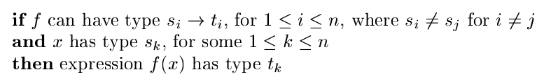

# 《编译原理》 day 44

今天是读《编译原理》的逻辑第 44 天，继续学习类型检查。

函数/操作符重载，根据上下文不同，操作符的行为跟着改变。比如 java 的 `+` 操作符，在操作数是 int/String 时有两种行为。



这条规则说人话应该就是参数的类型决定了函数的行为吧。

周志明老师的书里有道题目感觉很衬这条规则

```
class Human {}
class Man extend Human {}
class Woman extend Human {}

class StaticDispatch {
    void sayHello(Human guy) {
        System.out.println("Hello guy!");
    }
    void sayHello(Man guy) {
        System.out.println("Hello man!");
    }
    void sayHello(Woman guy) {
        System.out.println("Hello woman!");
    }
    public static void main(String[] args) {
        Human man = new Man();
        Human woman = new Woman();
        StaticDispatch sr = new StaticDispatch();
        sr.sayHello(man);
        sr.sayHello(woman);
    }
}
```

猜猜这段代码会打印出什么。

走到这里已经是极限了，再往后是一个叫 Unification（合一）的东西，完全不知道在讲什么，两个版本上下看了几遍，确认的确看不懂，弃。

感觉少了什么前置技能，有缘会在别的书上再见。

封面图：Twitter 心臓弱眞君 @xinzoruo