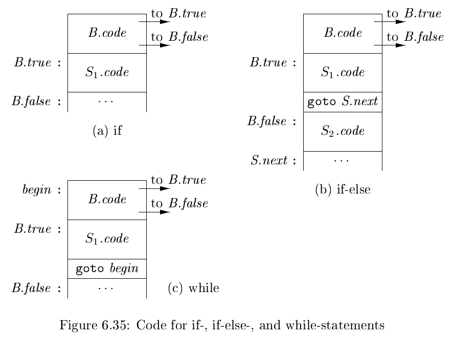
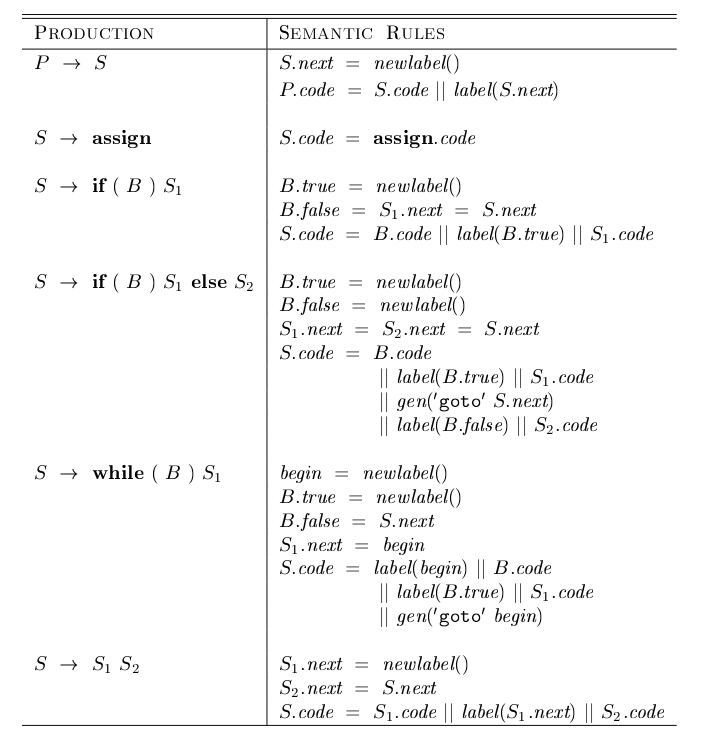
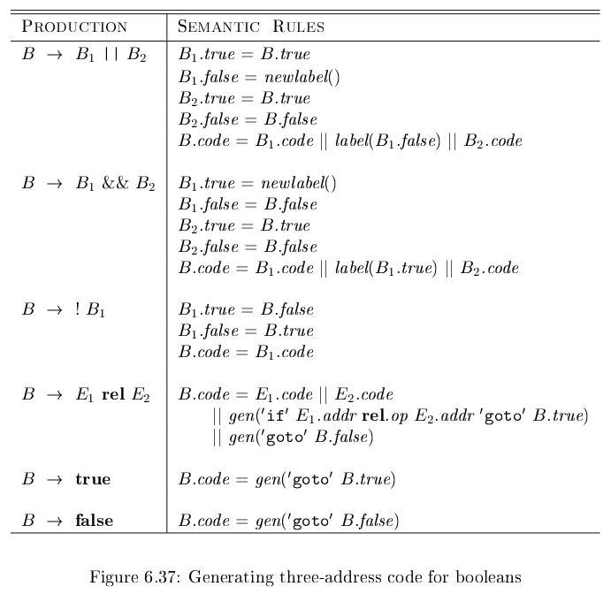
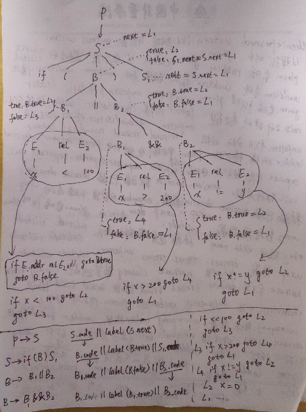
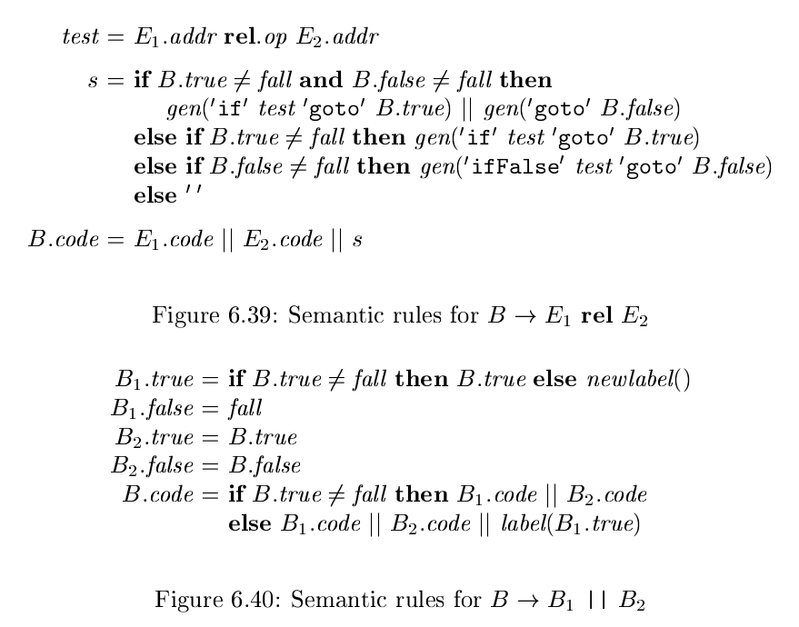

# 《编译原理》 day 45

今天是读《编译原理》的逻辑第 45 天，学习控制流，if，while 这种。

Boolean Expressions（布尔表达式）由布尔运算符和关系表达式组成，对应文法

B -> B \|\| B \| B && B \| !B | (B) \| E **rel** E \| **true** \| **false**

关系运算符 rel 常见的有 >，<，=，!=，>=，<= 这几个。

Short-Circuit Code（短路代码）听名字很唬人，看下来就是跳转代码。

Flow-of-Control Statements（控制流语句）最基本的就两个，条件和循环。

下面这三张图描述了控制流语句转换三地址代码的过程。光看倒也能看懂大概，很难想象他们是怎么设计出来的。







尝试手动演算表达式 `if (x < 100 || x > 200 && x != y) x = 0;` 确实能生成和书上一样的代码，就是头有点痛，另外纸越大越好。



这样生成的代码有冗余的 goto 指令，通过引入特殊标号 fall（取自 falls through）进行规避，不生成 goto 指令。

这样产生式 S -> if (B) S<sub>1</sub> 的语义规则不再拼接 label。

+ B.true = fall
+ B.false = S<sub>1</sub>.next = S.next
+ S.code = B.code || S<sub>1</sub>.code

其他产生式也可以对应修改



应用 fall 之后，生成的代码简洁了很多，只剩下三个 goto 指令，label 也少了。

```
        if x < 100 goto L2
        ifFalse x > 200 goto L1
        ifFalse x != y goto L1
L2:     x = 0
L1: 
```

不想再演算一遍了，就当是这么回事吧。

封面图：Twitter 心臓弱眞君 @xinzoruo