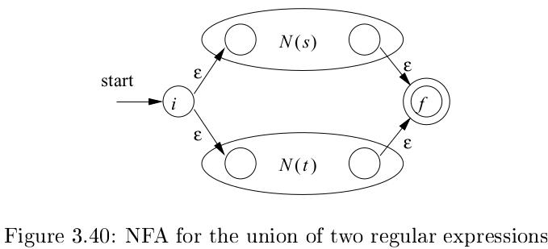

# 《编译原理》 day 19

今天是读《编译原理》的逻辑第 19 天，最后一块拼图，正则转 NFA，这个过程类似数学归纳。

假设 s, t 是两个正则表达式，N(s) 和 N(t) 是对应的 NFA，那么

对于 `r = s | t` 的 NFA 可以构建为



对于 `r = st` 的 NFA 可以构建为


对于 `r = s*` 的 NFA 可以构建为


这里又是把子表达式看成一个整体，另外还看到了 divide and conquer（分治）的思想，整个表达式构建很难，那就分成若干个子表达式，直到细分成容易解决的规模，然后再汇总解决方案。

这种方式还容易扩展，当需要增加操作符时只要定义对应的构建方式即可，其他的可以复用原来的。

以 `(a|b)*abb` 为例，首先找到最基本的情况

```
r1 -> a
r2 -> b
r6 -> a
r8 -> b
r10 -> b
```

这种正则很容易转 NFA，另外 r1 和 r6 虽然表达式一样，但不能复用，需要表示成两个 NFA。

接着构建 `r3 = r1 | r2`，2 -> 3 是原来的 N(r1)，4 -> 5 是原来的 N(r2)


接着构建 `r4 = (r3)`，这个直接用原来的 N(r3) 就行

接着构建 `r5 = r4*`，新增状态 0, 7，原 N(r4) 的结束状态指向开始状态。


接着构造 `r7 = r5r6`，新增状态 8，原 N(r5) 的终止状态和 N(r6) 的开始状态合并


接着依次合并 r8, r10 得到最终的 `(a|b)*abb` 的 NFA。

至此正则表达式实现完成，正则 -> NFA -> DFA 这个可能就是传说中的正则表达式编译过程，所以编码规范建议正则要预编译以提高性能。

另外 NFA 和 DFA 都能模拟，没必要非要转成 DFA，它们的时间复杂度各有优劣。

r 表示正则表达式长度，x 表示处理的字符串长度

|FA|初始化|处理字符串|
|--|--|--|
|NFA|O(r)|O(r * x)|
|DFA 常规|O(r^3)|O(x)|
|DFA 最差|O(r^2 * 2^r)|O(x)|

NFA 初始化有优势，DFA 处理字符串有优势。简单来看，如果正则表达式可以复用，处理大量字符串，那么使用 DFA 是划算的。反过来，如果正则表达式用一次就弃了，那么 NFA 用用就算了。

软件开发处处都是权衡。

封面图：Twitter 心臓弱眞君 @xinzoruo