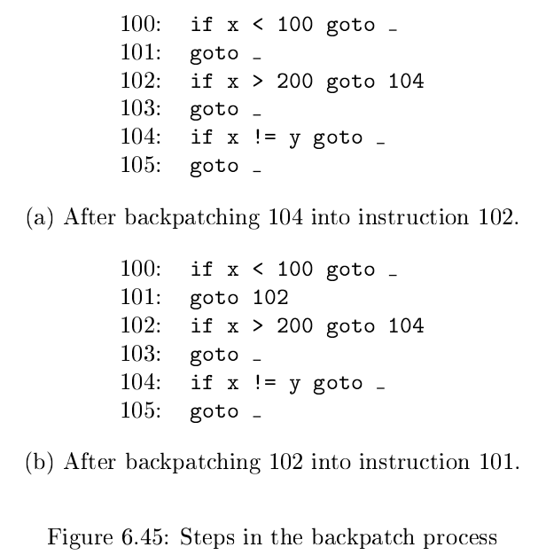

# 《编译原理》 day 46

今天是读《编译原理》的逻辑第 46 天，学习 Backpatching（回填）技术。

这个技术蛮神奇的，昨天的方法虽然可以在合适的地方标上 Li，但没有真正计算 Li 的值。

这是因为产生式 S -> **if** (B) S1 先生成 B.code 再生成 S1.code，导致 B 知道要 goto L2，但具体 L2 是多少要到 S1 生成后才知道。

于是为了填充 Li 需要再来一遍。

回填技术解决这个问题，它给指令编号，这样 Li 可以用指令编号表示。

产生式上加了几个特殊的非终结符，看起来为了传递属性。

语义动作上加了几个函数，应该是管理跳转的

1. makelist(i): 创建包含 i 的列表，i 是指令编号
2. merge(p1, p2): 合并 p1，p2 列表
3. backpatch(p, i): 把 i 填到列表 p 对应的指令里

然后是调整后的产生式，和表达式 `x < 100 || x > 200 && x != y` 的转化过程

非终结符 B 的综合属性 B.truelist 表示 B 为 true 时跳转的指令编码，B.falselist 和 S.nextlist 同理。

除了喊 666 没别的想法，这又是一个我不知道它是怎么运转的，但它的确能工作的算法。

回填技术不再生成 Li 取而代之的是一个空位，产生式 B -> B1 && M B2 回填 M.instr 到列表 B1.truelist，对应的是 {102} 指令的空位填充 104。

这下更像汇编了。

封面图：Twitter 心臓弱眞君 @xinzoruo