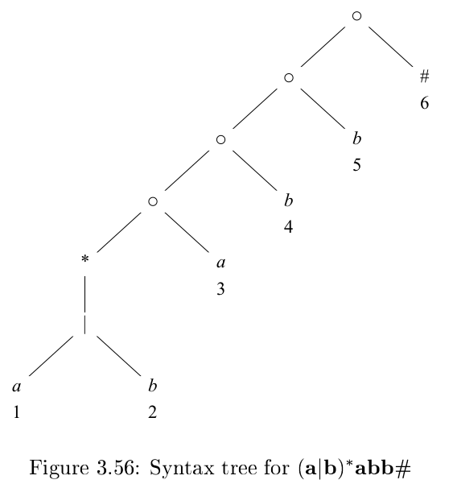
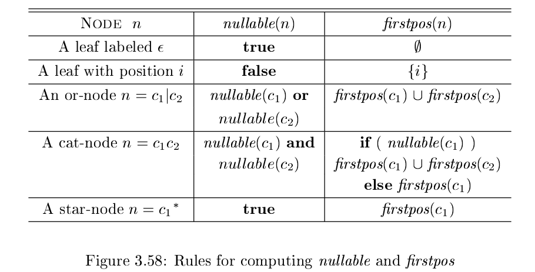
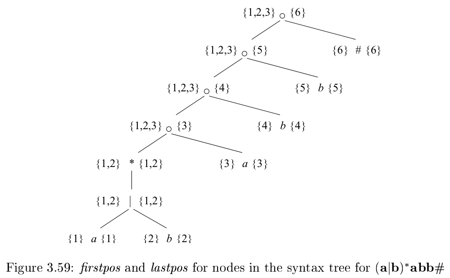
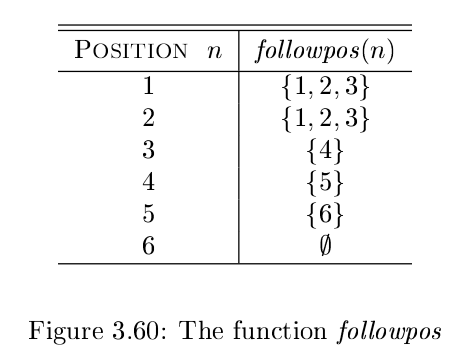
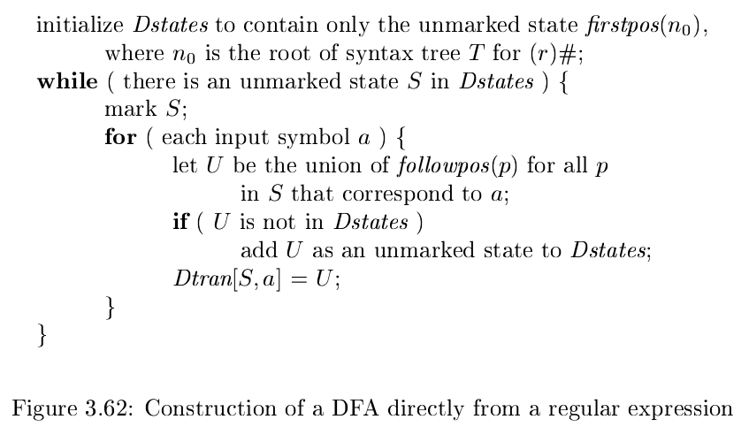

# 《编译原理》 day 20

今天是读《编译原理》的逻辑第 20 天，本来以为昨天 FA 就完结了，没想到还有一话，还是加长版。

这章主要介绍三个算法，虽然它说是算法，但我看着像魔法。

1. 直接通过正则表达式得到 DFA 不需要 NFA 这个中间商
2. 合并 DFA 状态，得到最少状态的 DFA
3. 生成更加小的转换表

第一个算法。

首先往正则表达式结尾添加 # 组成新的正则表达式 `(r)#`，叫扩展的正则表达式，居然没有翻译成增广。

然后构建一棵语法树，叶子结点标上意义不明的数字，记作 pos。

怎么有种套娃的感觉，印象里不是为了构造语法树才来搞词法的么。

然后定义 4 个函数 nullable(n), firstpos(n), lastpos(n), followpos(p)，前三个为了计算第四个。

另外前三个函数的入参 n 指的是语法树结点 n，也可以当做正则看，第四个入参 p 指的是位置（语法树叶子结点那个意义不明的数字）。

1. nullable(n): 语法结点 n 代表的正则是否可以包含空串
2. firstpos(n): 能出现在字符串第一个字符的 pos 集合
3. lastpost(n): 能出现在字符串最后一个字符的 pos 集合
4. followpos(p): 我理解是能跟在位置 p 后面的 pos 集合

比如 `n = (a|b)*a`

1. nullable(n) = false，它至少包含字符 a，不含空串
2. firstpos(n) = {1,2,3}，字符串 aa, ba 说明位置 1，位置 2 能出现在第一个字符，字符串 a 说明位置 3 能出现在第一个位置，此时 `(a|b)` 出现 0 次。
3. lastpos(n) = {3}，出现在最后一个字符的只能是位置 3

nullable, firstpos 的形式化计算规则。

lastpos 类似 firstpos，互换一下 c1, c2。

最后计算 followpos，这段感觉中文版有印刷错误。

followpos 计算规则有两条

1. 如果 n 是 cat-node，左右子节点是 c1, c2，那么 lastpos(c1) 中的每个位置 i，followpos(i) 包含 firstpos(c2) 所有元素
2. 如果 n 是 star-node 且 i 是 lastpos(n) 的元素，followpos(i) 包含 firstpos(n) 所有元素

大写的寄！芭比Q了。

计算完成的 firstpos（左）、lastpos（右）和计算完成的 followpos。

然后通过伪代码计算 Dtran，和之前的伪代码有点像，又有点不一样。

Dtran 就是 DFA 的转换图，换句话说 DFA 已经构造好了。

嘶~~~，怎么就构造出来了，疑问太多，以至于好像又没有疑问了，这就是开头为什么我说它是魔法。

封面图：Twitter 心臓弱眞君 @xinzoruo