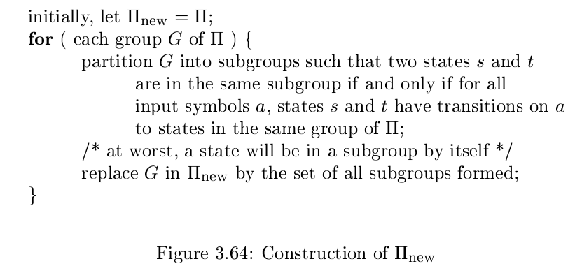
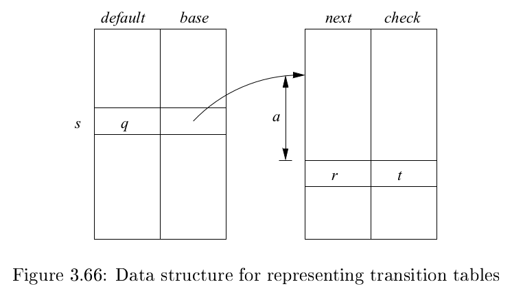

# 《编译原理》 day 21

今天是读《编译原理》的逻辑第 21 天，接昨天，介绍剩下两个魔法。

第二个魔法，最小化 DFA 状态数量。

1. 初始化分区 Π，包含两个分组 F 和 S - F，F 是终止状态集合，S 是所有状态集合。
2. 对于 Π 的每个分组 G 尝试拆分，通过所有输入字符到达相同状态的状态归为一组。最差的情况每个状态各自成组，最好的情况 G 拆不开。
3. 如果 Π 被拆开了，重复步骤 2，否则下一步
4. Π 的每个分组选出一个代表，构建最小 DFA
   1. 包含了原 DFA 开始状态的分组作为新 DFA 的开始状态，肯定只有一个
   2. 包含了原 DFA 终止状态的分组作为新 DFA 的终止状态
   3. 其他状态用选出的代表表示，同属一个分组的状态通过任意字符 a 到达的状态都是一样的

算法伪代码



第三个魔法，生成更小的转换表，这位更是重量级。

准备四个数组，default base next check 然后用下面这个函数计算下一个状态。

```
int nextState(s, a) {
    if (check[base[s] + a] == s) {
        return next[base[s] + a];
    } else {
        return nextState(default[s], a);
    }
}
```



哇塞，演都不演一下了么，还没说四个数组怎么构造呢。

问了下谷老师，找到一篇稍微好懂一点的

> https://stackoverflow.com/questions/29139162/dfa-state-transition-table-compression

也许和稀疏矩阵有点关系？

这三个算法看的我，唔唔唔~~~ 哈…哈…哈… 告辞。

封面图：Twitter 心臓弱眞君 @xinzoruo