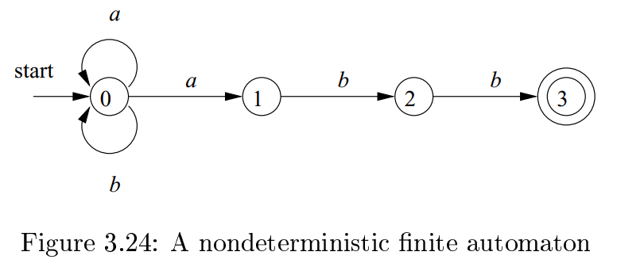
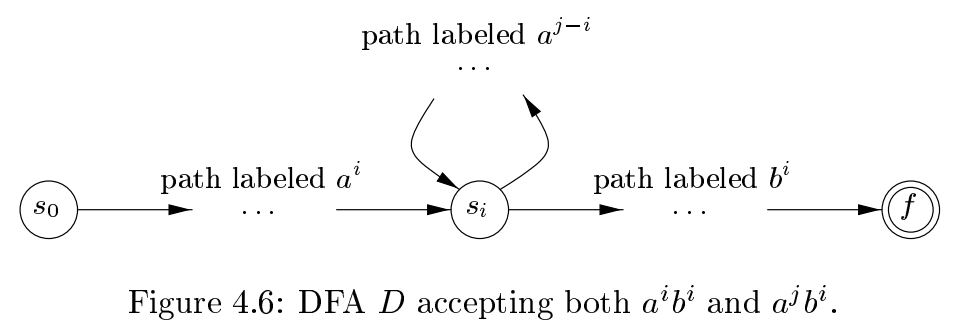

# 《编译原理》 day 24

今天是读《编译原理》的逻辑第 24 天，继续学习语法分析。

一些符号约定，仅适用于于本书，为了方便理解。

1. 表示终结符的符号
   1. 靠前的小写字母，比如 a b c 这个其实有点迷，多少算靠前
   2. 操作符
   3. 标点符号
   4. 数字
   5. 黑体字符串，相当于 Token 名字
2. 表示非终结符的符号
   1. 靠前的大写字母
   2. 大写字母 S 通常当做开始符号
   3. 斜体字符串
3. 靠后的大写字母，如 X Y Z，可以是终结符也可以是非终结符
4. 靠后的小写字母表示终结符号串
5. 小写希腊字母表示文法符号串，或者说产生式的右边部分

对于一个产生式 E -> - E \| **id** 用 - E 代替 E 这个过程可以记为

$$
E \Rightarrow - E
$$

读作 E 推导 - E。

类似的如果经过多个推导步骤

α1 => α2 => ... => αn 记为 

$$
α_1 \stackrel{*} \Rightarrow α_n
$$

这个 => 符号上面的 * 号还可以换成 + ?，意思等同于正则表达式里这两个符号的意思，还挺统一。

总是替换第一个非终结符的推导叫最左推导，记为

$$
a \xRightarrow[lm]{} b
$$

总是替换最后一个非终结符的推导叫最右推导，记为

$$
a \xRightarrow[rm]{} b
$$

一个字符串一般有多个推导过程。

分析树是推导的图形表示，一般来说分析树和推导是一对多关系，分析树只关注最后的结果，而推导还会关注过程。但是限制最左或者最后推导那么就是一对一关系了。

文法可以表示任何正则表达式，反过来不行。通过正则表达式的 NFA 构建文法，过程是这样的

1. 每个 NFA 状态 i 都是非终结符，记为 Ai
2. 每个状态转换 move(i, a) = j，记为产生式 Ai -> aAj
3. 如果 i 是终止状态，记为产生式 Ai -> ε
4. 如果 i 是开始状态，那么 Ai 是开始符号

举个例子，正则表达式 `(a|b)*abb` 对应的 NFA 如图

对应的文法是

+ A0 -> aA0 \| aA1 \| bA0
+ A1 -> bA2
+ A2 -> bA3
+ A3 -> ε

只能说 666 还能这么玩。

反过来文法 `S -> aSb | ε` 产生语言 { anbn \| n >=1 }，它没法用正则来表示。

用反证法，假设存在正则表达式，那么一定对应一个有 k 个状态的 DFA，对于 n > k 的字符串一定存在某个状态 i 通过两次，换句话说部分状态形成一个环，那么去掉这个环组成的字符串也满足这个表达式，冲突。

这个反证法总觉得哪里见到过，但用在这里还蛮新奇的。

封面图：Twitter 心臓弱眞君 @xinzoruo