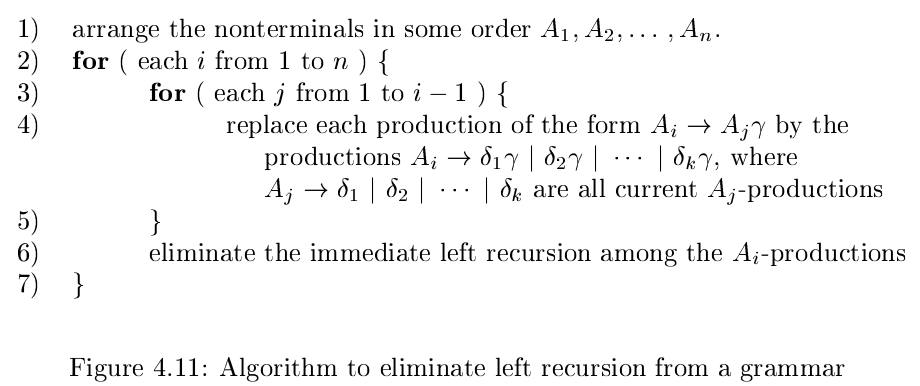

# 《编译原理》 day 25

今天是读《编译原理》的逻辑第 25 天，学习如何转化文法以适应预测分析法。主要使用两个算法，一个用来消除左递归，一个用来确定产生式。

开始之前先看一下词法和语法分离的好处

1. 分离有助于控制模块大小、复杂度
2. 词法通常很简单，不需要文法这样的牛刀
3. 相比文法，正则表达式更加简洁易懂
4. 正则实现效率更高

另外文法也不是万能的，类似限制变量使用前需先声明，它就做不到，所以后面还会跟着一个语义分析的组件。

合适的场景使用合适的工具提供合适的性能，说软件开发是门艺术也没错。

预测分析法不能有左递归，不仅文法的产生式不能有，通过文法推导的也不能有，举个例子。

+ S -> Aa \| b
+ A -> Ac \| Sd \| ε

咋一看 S -> Aa \| b 不是左递归，实际上把 A -> Sd 代入得到 S => Aa => Sda 也是左递归。

消除左递归有个通用的方式，首先分组，有左递归的一组，其他另一组，形成这样的格式

A -> Aα1 \| Aα2 \| ... \| Aαm \| β1 \| β2 \| ... \| βn

然后转化成两个产生式消除左递归

+ A -> β1A' \| β2A' \| ... \| βnA'
+ A' -> α1A' \| α2A' \| ... \| αmA' \| ε

原来之前的左递归消除术都来自这里。

下面这个算法消除所有左递归，只能在产生式没有环的情况下工作

这个算法先调整产生式保证所有的产生式有这样的结构 Ai -> Amα，m >= i，用更加靠后的非终结符表示靠前的非终结符，然后再消除 Ai 的左递归。

除了消除左递归，还要可预测，通过提取左公因子实现，和乘法的提取公因数有点像。

对于产生式 A -> αβ1 | αβ2 | ... | αβn | γ 提取 α 然后转化为两个产生式

+ A -> αA' \| γ
+ A' -> β1 \| β2 \| ... \| βn

这样就实现了通过 α 唯一确定一个产生式，可以使用预测分析法。

妙啊妙啊。

封面图：Twitter 心臓弱眞君 @xinzoruo