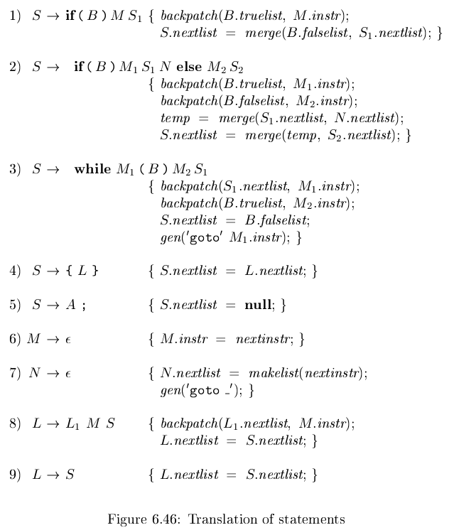

# 《编译原理》 day 47

今天是读《编译原理》的逻辑第 47 天，崩了。

按照计划是控制流语句的回填实现，但昨天看布尔表达式回填就很费劲了，今天的控制流语句更绝。

几乎每一句产生式都插入标记非终结符，这玩意儿乱插入真的没问题么。

还有这个产生式 `S -> A;` 设置的 S.nextlist = null 这又是为啥，这是说赋值语句不会有 goto 操作么，还是说把 A 当做终结符来处理了，不懂啊。。。

想念大学时光，至少那时候还能有个人可以问问。

再往后 break 语句，continue 语句，switch 语句就更神游了，看个寂寞。

一到章节末就开始各种不懂，这也许就是极限吧。

算了，放飞自我了，原神 3.2 还是明天开，白失眠了一个晚上，明天必敲烂教令院大门，让他们知道什么叫社区送温暖。

只有小草神才能平静糟乱的心。

封面图：Twitter 心臓弱眞君 @xinzoruo