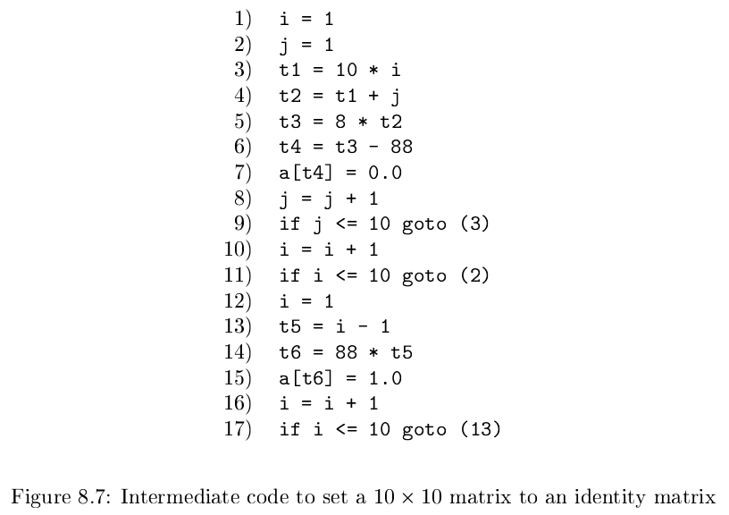
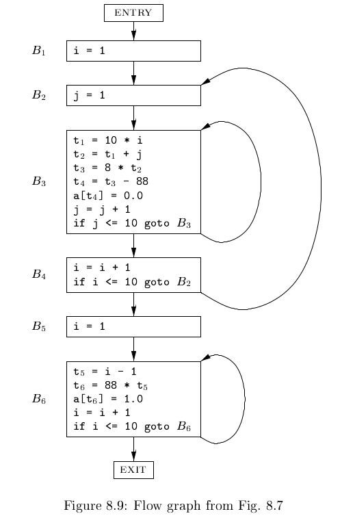

# 《编译原理》 day 63

今天是读《编译原理》的逻辑第 63 天，学习基本块和流图。

基本块满足条件

1. 控制流只能从基本块的第一条指令进入
2. 控制流只能从基本块最后一条指令出去

这两个限制，意味着在基本块内不存在跳转。

多个基本块组成流图，流图也是一种中间表示，结点前面结点叫前驱，结点后面的结点叫后继，这个叫法和链表一致。

这两个概念估计是为了后面优化打铺垫，优化一大坨代码很难，那就拆成小坨分别优化。

基本块划分通过寻找 leader（首指令）完成，首指令有三种

1. 中间代码的第一条三地址指令是首指令
2. 条件跳转或无条件跳转的目标指令是首指令
3. 紧跟在条件跳转或无条件跳转的指令是首指令

这段三地址代码的首指令是 1，2，3，10，12，13，按照上面的条件分类是

1. {1}
2. {3, 2, 13}
3. {10, 12}

指令 17 后面没有了，如果有的话也是首指令。

拆成六个基本块，构成的流图

流图通常有两个额外的结点 ENTRY 和 EXIT，分别表示入口和出口，暂时意义不明。

识别流图中的循环，循环是一个结点集合 L，包含一个叫做 loop entry（循环入口）的结点 e，这个 e 满足条件

1. e 不能是 ENTRY，也就是流图的入口
2. e 是集合 L 里唯一一个可以有 L 以外的结点当前驱的结点
3. L 中的每个结点，有一条非空路径到 e

说了那么多，直观来看就是基本块组成一个环，上面的流图里，有三个循环

1. {B3}
2. {B6}
3. {B2, B3, B4}

封面图：Twitter 心臓弱眞君 @xinzoruo