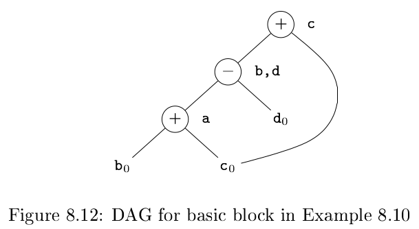

# 《编译原理》 day 64

今天是读《编译原理》的逻辑第 64 天，学习基本块优化。

基本块优化先把三地址代码转化成 DAG，how old are you.（怎么老是你）

DAG 的构建方法

1. 每个变量的初始值代表一个节点
2. 每条三地址代码 s 代表一个节点
3. 结点 N 的标号是 s 的操作符，关联一组变量，表示 s 是基本块内最晚对这些变量定义的语句
4. 某些结点被指明为输出结点，这些结点对应的变量在流图中被其他基本块用到，叫做在出口处 live（活跃）

DAG 可以优化的代码种类

1. 消除局部公共表达式
2. 消除死代码，变量计算了但永远不用
3. 重排序相互独立的语句，降低临时变量在寄存器中的时间
4. 使用代数各种律重排序操作数，有概率简化计算过程

消除公共表达式的算法和之前一样，在创建结点 N 之前先查一下有没有一样的，有直接返回，没有再创建

```
a = b + c
b = a - d
c = b + c
d = a - d
```

上面的三地址代码 2，4 是公共表达式，于是生成 DAG



假设变量 b 不活跃，那么 DAG 转回三地址代码只需要三条

```
a = b + c
d = a - d
c = d + c
```

如果 b 活跃，那么需要额外赋值语句 `b = d` 也有了优化。

消除死代码，假设下面的三地址代码，a, b 活跃，c, e 不活跃

```
a = b + c
b = b - d
c = c + d
e = b + c
```


从 DAG 删除不活跃的根结点 e，此时 b，c 成为新的根节点，再删除 c，最后只剩下两条指令

```
a = b + c
b = b - d
```

代数恒等式，使用代价低的运算代替代价高的运算，加减替换乘除，乘法替换除法

```
x + 0 = 0 + x = x
x - 0 = x
x * 1 = 1 * x = x
x / 1 = x
x ^ 2 = x * x
2 * x = x + x
x / 2 = x * 0.5
```

另一类优化叫做 constant folding（常量合并）计算常量值，然后替换所有常量表达式，比如表达式 2 * 3.14 替换为 6.28。

某些关系运算也可能产生公共表达式，比如 `x - y` 和 `x > y`。

使用结合律有时也能优化

```
a = b + c
t = c + d
e = t + b
```

假设 t 是临时变量，可以优化成两条语句

```
a = b + c
e = a + d
```

优化这么牛逼的事情，感觉被它一拆解，也没那么难了，我感觉又行了。

封面图：Twitter 心臓弱眞君 @xinzoruo