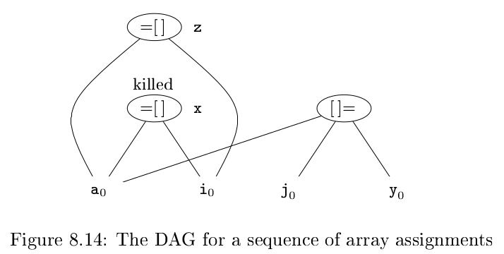
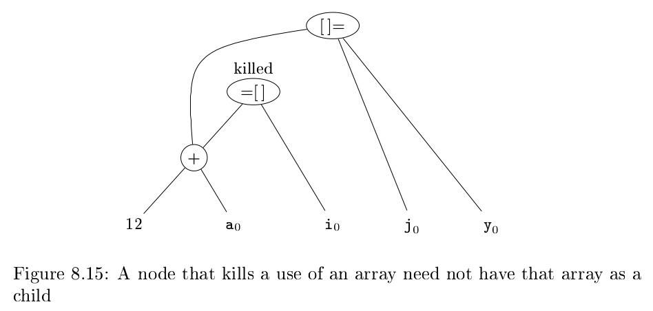

# 《编译原理》 day 65

今天是读《编译原理》的逻辑第 65 天，继续基本块优化。

数组的 DAG 表示

1. 数组访问 `x = a[i]`，结点操作符是 `=[]`，两个子节点是数组变量 a 和索引值 i，x 是结点关联的变量
2. 数组赋值 `a[j] = y`，结点操作符是 `[]=`，三个子节点是数组变量 a，索引值 i 和变量 y，结点不关联变量。这个结点创建时 kill（杀死）当前已经建立的，依赖 a 的结点，被杀死的结点不能成为公共表达式。

用 `x = a + i` 的角度来看 `x = a[i]` 大概是这个样子 `x = a =[] i`。

两个例子

```
x = a[i]
a[j] = y
z = a[i]
```



之所以要杀死结点，不让它复用，是因为如果 i = j，这时候 a[i] 的值发生了修改，如果复用，那么 z = x，程序出错。

```
b = 12 + a
x = b[i]
b[j] = y
```



这个例子展示子节点不是数组，但后代有结点是数组的情况，也需要杀死对应结点。

别问为什么加法的结果还能当数组用，问就是魔法。

指针赋值有类似的操作。

`x = *p` 的 DAG，它的子节点是所有关联变量的结点。

`*p = y` 更离谱，杀死所有已经构造出来的结点。

因此通常需要知道指针来源

```
p = &x
*p = y
```

这两句代码可以知道是 x 被赋值，因此只要杀死关联 x 的结点就够了。

有一点我是看明白了，指针优化很复杂，那我不用指针岂不是相当于帮了编译器！

DAG 重构基本块的指令顺序

1. 指令的顺序必须遵循 DAG 中结点的顺序，先计算子节点，在计算本节点
2. 同一个数组的访问操作可以互相跨越，但赋值操作不能跨越
3. 语句不能跨越过程调用/指针赋值

封面图：Twitter 心臓弱眞君 @xinzoruo