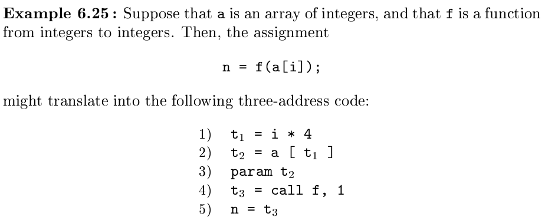
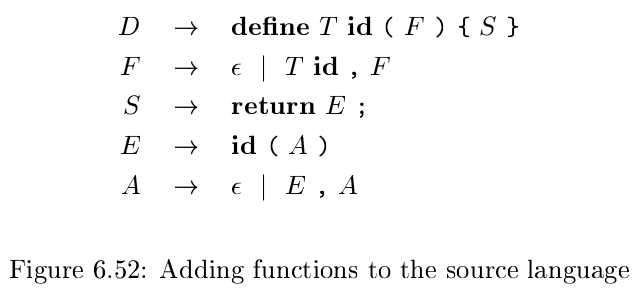

# 《编译原理》 day 48

今天是读《编译原理》的逻辑第 48 天，学习过程（或者叫函数）转三地址代码。

上面两张图是函数的文法和对应的转化过程，意外的很简洁，语义动作啥的都没写，而且连 goto 语句都没有，用了 call 指令代替，这不对劲啊，不符合它的风格。

出现这种情况，要么是真简单，要么是太复杂，这里先放个引子热热身，慌得一批。

转换过程用到一些概念

+ Function types: 函数类型包含返回值类型和形参类型，void 是特殊类型，表示没有返回值或者形参。它的类型表达式可以用 fun + 返回值类型 + 形参列表
+ Symbol tables: 函数定义时生成新的符号表，函数体转换完成后弹出上层符号表
+ Type checking: 同其他操作符进行检查和推导
+ Function calls: 先对所有参数 E 求值，按顺序给每个参数生成 param 指令，再执行 call 执行，我有预感，这个 call 指令指定很复杂

今天就先到这里，我要去敲门了。

封面图：Twitter 心臓弱眞君 @xinzoruo