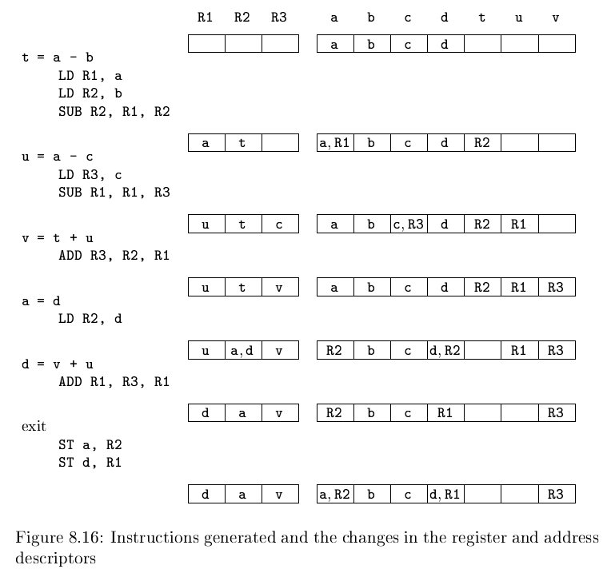

# 《编译原理》 day 66

今天是读《编译原理》的逻辑第 66 天，学习单个基本块代码生成。

寄存器的使用

1. 大部分机器架构，要求操作数在寄存器才能运算
2. 寄存器适合保存临时值
3. 寄存器适合保存全局值，即这个基本块计算，另一个基本块使用，比如循环的索引
4. 寄存器帮助存储管理，比如栈指针

Register descriptor: 寄存器描述符，跟踪一个寄存器存放了多少变量

Address descriptor: 地址描述符，跟踪那些位置上能找到这个变量的值

这个描述符居然不是整数而是集合。

简单起见用 R(R) 表示 R 的寄存器描述符，A(x) 表示 x 的地址描述符。

语句 `x = y + z` 生成步骤

1. 使用 `getReg(x = y + z)` 选择寄存器 R<sub>x</sub>，R<sub>y</sub>，R<sub>z</sub>
2. 如果 y 不在 R<sub>y</sub>，生成 LD R<sub>y</sub>, y
3. z 同理
4. 生成 ADD R<sub>x</sub>, R<sub>y</sub>, R<sub>z</sub>

语句 `x = y` 特殊，只需要在 R(R<sub>y</sub>) 添加 x 即可

基本块收尾处理，对于所有活跃的变量 x 生成 `ST x, R` 保存变量到内存地址

部分指令的描述符管理

1. LD R, x
   1. R(R) = {x}
   2. A(x) = A(x) U {R}
   3. A(x') 删除 R，这里的 x' != x
2. ST x, R
   1. A(x) = A(x) U {x}
3. ADD R<sub>x</sub>, R<sub>y</sub>, R<sub>z</sub>
   1. R(R<sub>x</sub>) = {x}
   2. A(x) = {R<sub>x</sub>}
   3. A(x') 删除 R<sub>x</sub>，这里 x' != x
4. x = y
   1. R(R<sub>y</sub>) = R(R<sub>y</sub>) U {x}
   2. A(x) = {R<sub>y</sub>}

```
t = a - b
u = a - c
v = t + u
a = d
d = v + u
```



这个例子演算下来有个疑问，第五句 `d = u + v`，R(R<sub>2</sub>) 的 d 不知道怎么清掉的，按上面描述，操作的是 R<sub>1</sub> 和 d，关 R<sub>2</sub> 什么事，怎么就躺枪了。

函数 `getReg(I)` 的设计，以 `x = y + z` 为例

1. 如果 y 已经在寄存器，选它
2. 如果 y 不在寄存器，但有空闲的寄存器，选空闲的
3. 如果 y 不在寄存器，没有空闲的寄存器，选择得分最低的 R。得分通过遍历 R 的变量 v 计算，情况 4 得一分
   1. A(v) 显示还有其他地方保存 v 值
   2. v 是 x 且 x 不是 I 的操作数，原因是 x 的当前值不会再使用，黑人问号
   3. v 以后不会再使用
   4. 上面三个条件都不满足，生成 ST v, R 拷贝到内存地址，这个操作叫 spill（溢出）

巨复杂，而且这描述总觉得很可疑，要想真看懂，估计还得看源码。

自然语言描述准确需求就是个坑，说的就是需求文档。

R<sub>x</sub> 选择宽松点，因为 x 是一个正在被计算的值，可以选择只包含 x 的寄存器。

一切的根源都是寄存器太稀缺，不然哪那么多事。

封面图：Twitter 心臓弱眞君 @xinzoruo