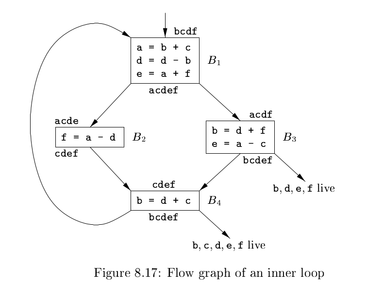

# 《编译原理》 day 68

今天是读《编译原理》的逻辑第 68 天，学习寄存器的分配和指派，依然分不清这俩有啥区别。

基本块在收尾阶段需要生成 ST 指令，但假如下一个基本块要使用，又需要通过 LD 加载，如果有全局寄存器持有这个变量值，那么可以省下这两个指令。

全局寄存器的分配策略之一是分配固定数量的寄存器存放每个内部循环中最活跃的值。

通过 usage counts（使用计数）估算分配寄存器给变量 x 的收益，公式

$$
\sum_{block \ B \ in \ L} use(x, B) + 2 * live(x, B)
$$

`use(x, B)` 表示基本块 B 中变量 x 定义前使用的次数。强调定义前是因如果有指令定义 x，那么它大概率已经在寄存器。

`live(x, B)` 只有 0，1。1 表示基本块 B 定义变量 x 且出口处活跃。

|变量|use|live|total|
|--|--|--|--|
|a|2|1|4|
|b|2|2|6|
|c|3|0|3|
|d|4|1|6|
|e|0|2|4|
|f|2|1|4|

我怎么算变量 b 都有 6，为毛书里是 5，在 B1 使用两次，在 B3，B4 活跃，那不就是 6 么。

我都怀疑是不是写错了，查了勘误表，没有这条，好迷啊。

如果只有三个全局寄存器，可以分配给 a，b，d。

当没有寄存器可用时，发生溢出，保存某个寄存器到内存位置，图着色算法处理这种情况。

构造 register-interference graph（寄存器冲突图），顶点是寄存器，对于任意两个顶点，如果一个顶点在另一个被定义的地方是活跃的，那么两个顶点之间有一条边。

基本块 B1 的 a 和 d，第二句 d 被定义的时候 a 活跃，所以 ad 之间有边。

？？？

大脑已死机，正在断开电源。。。

封面图：Twitter 心臓弱眞君 @xinzoruo