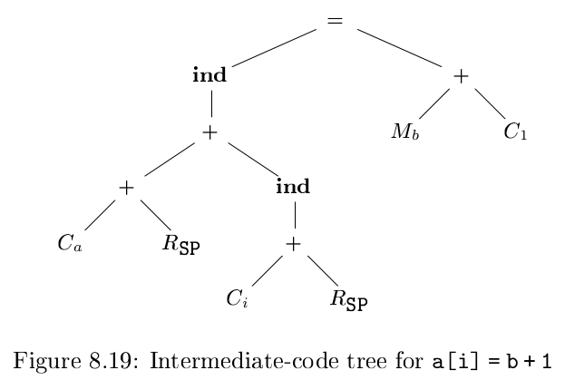
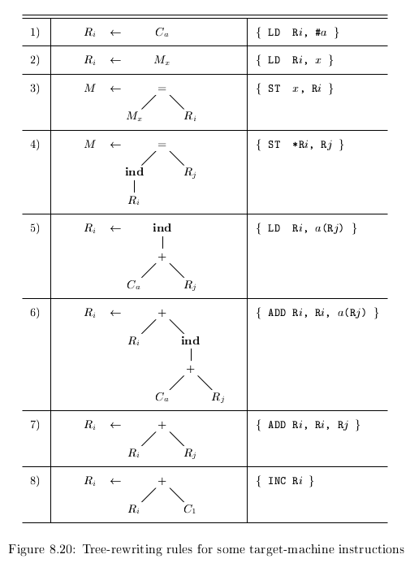

# 《编译原理》 day 69

今天是读《编译原理》的逻辑第 69 天，学习另一个指令选择方案：Tree Rewriting（树重写）。

这个技术表面上很好理解，背地里根本不知道要怎么做。

说它好理解是因为很像语法指导翻译，有类似产生式的东西，执行过程像 LR 算法，归约时产生指令，归约到根节点结束。

说它难是因为上来就是一个 ind 操作符。

三地址代码 `a[i] = b + 1` 对应的树状结构



啊这……

操作符 ind 说是把操作数当内存地址，啥玩意儿。

树重写不断应用规则 `replacement <- template { action }` 归约，replacement 是替换后的结点，template 是匹配的子树，action 是需要生成的指令

一些树重写规则，C 代表常量，下标是值，M 代表内存位置，下标是变量，R 代表寄存器



使用这些规则可以归约上面的树，依次使用规则 1，7，6，2，8，4，生成对应指令

```c
LD  R0 #a
ADD R0, R0, SP
ADD R0, R0, i(SP)
LD  R1, b
INC R1
ST  *R0, R1
```

它说了这么多，有个问题始终没说，这棵树怎么来的。

封面图：Twitter 心臓弱眞君 @xinzoruo