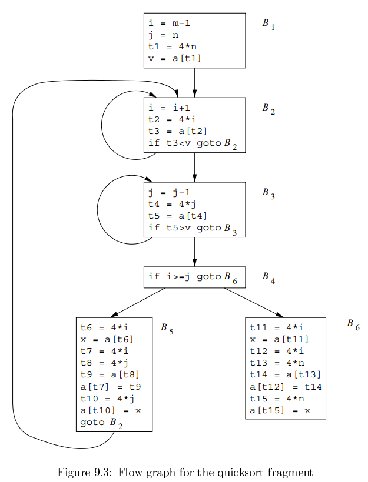
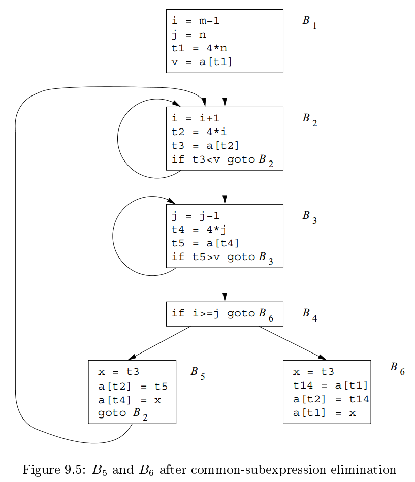

# 《编译原理》 day 71

今天是读《编译原理》的逻辑第 71 天，学习机器无关优化。

不要啊，怎么还有优化，还是全局的。

唉……慢慢啃吧。

优化的主要来源是冗余。这个确实，以前有见过代码重复率接近 50% 的项目，源代码层面都有这么多冗余，更不用说转成三地址代码了。

另一方面，有些冗余还是需要的，提升可读性。

下面这段是快排算法的流图，接下来要对它进行优化以展示全局优化有哪些项目

B5 的 4 * i 和 4 * j 是公共表达式，使用 t6 代替 t7，t8 代替 t10，这是上一章基本块的优化内容。

消除之后还有全局公共子表达式 B2 的 t2 代替 B5 的 t6，替换后 a[t2] 又是公共子表达式，t3 代替 a[t2]。

消除所有公共子表达式后，流图变为

复制传播，如果存在 u = v 这样的赋值表达式且 u 没有发生变化，那么后续使用 v 代替 u。

复制传播本身不能优化什么，但经过调整后，可能发现新的优化点。

B5 使用复制传播，t3 代替 x。

死代码消除，消除那些计算了但没用的变量。

变量 live（活跃）代表程序某个点，它的值在后续被使用，否则就是 dead（死的）。

B5 经过复制传播后，变量 x 是死的，消除 x = t3 指令

不对劲啊，这套路就是之前基本块的套路，那这发展下去，岂不是又要遇到之前的 BOSS，还是威力加强版。

封面图：Twitter 心臓弱眞君 @xinzoruo