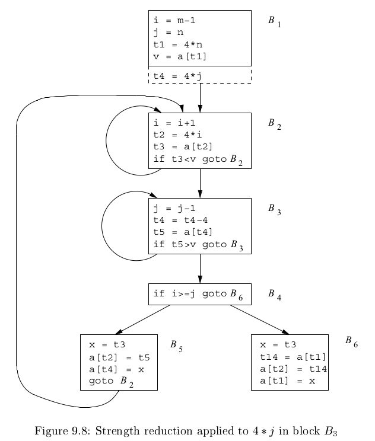
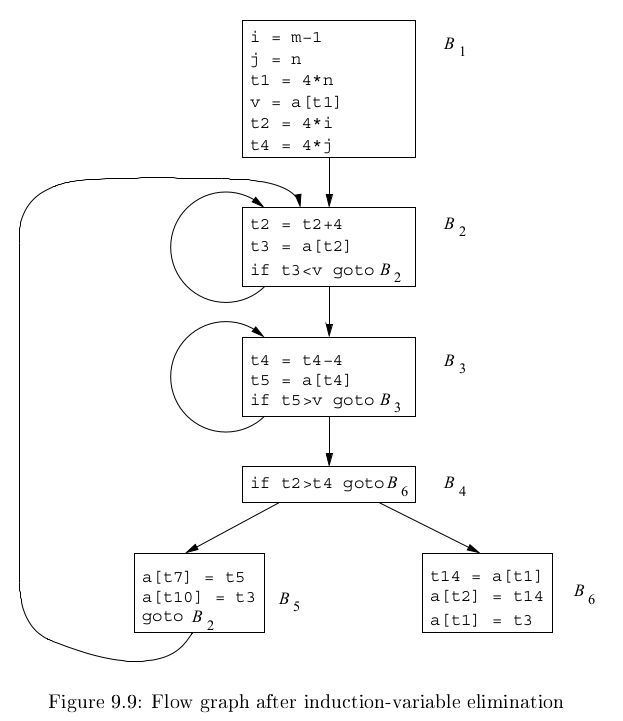

# 《编译原理》 day 72

今天是读《编译原理》的逻辑第 72 天，继续优化

Induction variables（归纳变量）说的是变量 x 每次赋值总是增加常量 c。

识别归纳变量帮助发现优化点，B3 的 t4 和 j 都是归纳变量，使用 t4 = t4 - 4 代替 t4 = 4 * j，调整后 t4 需要初始化，在 B1 增加 t4 = 4 * j。

同理优化 B2 的 i 和 t2，出现新的优化点

+ t2 = 4 * i
+ t4 = 4 * j

那么使用 t2 > t4 代替 i > j，替换后消除死变量 i，j。

牛逼，我怕它再优化下去，代码都给它化没喽。

数据流分析，我知道后面有 BOSS 但没想到来的这么快，这才第二节，越发理解勿在浮沙筑高台了。

封面图：Twitter 心臓弱眞君 @xinzoruo