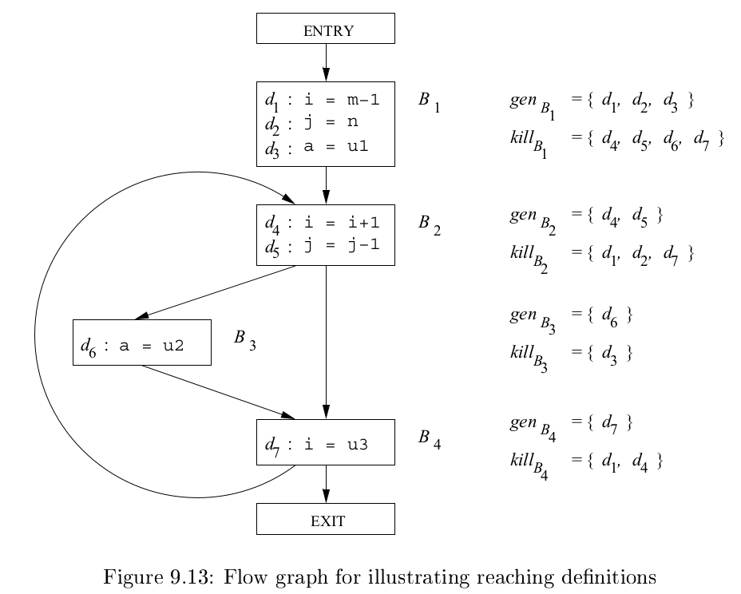
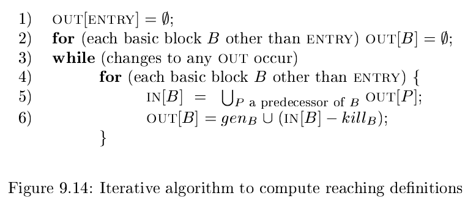
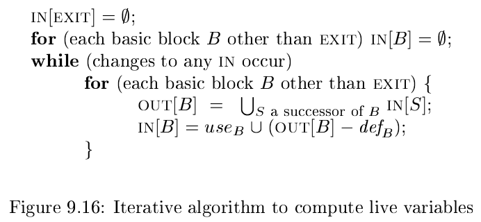
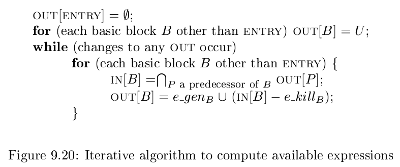

# 《编译原理》 day 73

今天是读《编译原理》的逻辑第 73 天，学习数据流分析。

数据流分析是一个抽象概念，定义一种计算模式，每条语句 s 关联集合 IN[s] 和 OUT[s] 分别表示语句前后的数据，然后计算所有的 IN[s] 和 OUT[s]。

数据也可以直接关联在基本块，基本块逻辑简单，都是顺序执行。

数据流分析的关键是理顺两个约束

1. 传递函数
2. 控制流约束

这两个约束实际是两个方程。

Reaching Definitions（到达定值）分析是一种具体的数据流分析，分析变量 x 在哪些地方被定值，话说 define 被翻译成定值也有点怪怪的。

传递函数

$$
OUT[B] = gen_B \cup (x - kill_B)
$$

genB 和 killB 看图更直观

对于语句 `d: u = v + w` 生成 u 的定值 d 同时杀死其他 u 的定值，B1 定义 i, j, a 生成三条定值，同时它杀死其他定义 i, j, a 的定值，比如变量 i 还有定值 d4 和 d7 放入 killB 集合。

控制流约束，B 的到达定值是它前驱到达定值的并集

$$
IN[B] = \bigcup_{P \ a \ predecessor \ of \ B} OUT[P]
$$

接着根据两个方程求解 IN[B] 和 OUT[B]

这个算法笃定 IN[B] 和 OUT[B] 一定会收敛，上一次见到这样的算法还是 page rank 算法。

Live-Variable（活跃变量）分析是另一种具体的数据流分析，它是逆向的，函数反着写。

传递函数

$$
IN[B] = use_B \cup (OUT[B] - def_B)
$$

+ defB 表示变量先定值，再使用
+ useB 表示变量先使用，再定值。可能在某些地方初始化了。

控制流约束

$$
OUT[B] = \bigcup_{S \ a \ successor \ of \ B} IN[S]
$$

Available Expression（可用表达式）分析是第三种具体的数据流分析。

传递函数

$$
OUT[B] = e\_gen_B \cup (IN[B] - e\_kill_B)
$$

控制流约束

$$
IN[B] = \bigcap_{P \ a \ predecessor \ of \ B} OUT[P]
$$

总的来看，先根据需求找到要分析的数据，然后寻找两个方程，最后通过计算得到所有的 IN/OUT 数据。

封面图：Twitter 心臓弱眞君 @xinzoruo