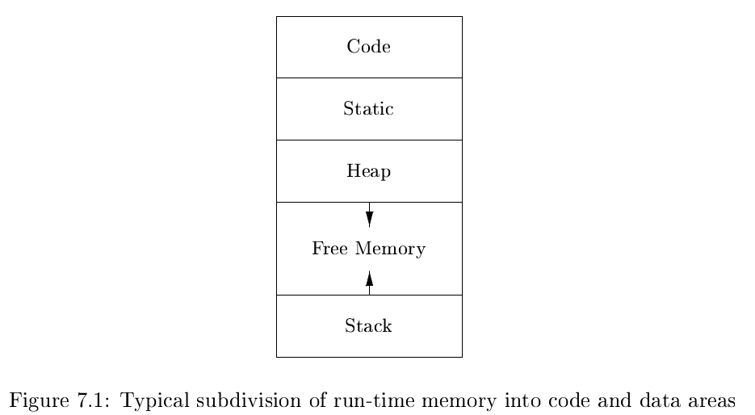

# 《编译原理》 day 50

今天是读《编译原理》的逻辑第 50 天，学习 Storage Organization（存储组织）。

从第 7 章开始讲的是后端编译器，挺好的，相当于重置了，这样之前累积下来的不懂就不会有太大的影响。

编译器使用 run-time environment（运行时环境）实现作用域、过程、运算符、控制流等概念。这玩意儿居然是编译器创建的，编译器的工作不是编译完代码就结束了么。

根据前面所学，运行时环境是 name 到 location 的映射，从这个角度看好像也能理解，但如果是这样的话岂不是代码还没运行就有运行时环境了，这个命名是不是有点奇怪了，算了，不纠结了。

上面这种图是典型的存储分配方式，从上往下地址逐渐变大，最上面是代码区，存放指令的地方，指令怎么用 0，1 表示可以看看《Computer Systems》/《深入理解计算机系统》第三章，第一次看到还是很震撼的，虽然这震撼来的有点迟。

接着是静态区，存放一些编译时就能确定的数据，常量啥的。最后是堆区和栈区，可以动态调整大小，一个向上增长，一个向下增长。

内存分配分静态和动态，编译时分配的叫静态，运行时分配的叫动态，计算机科学里但凡叫静态的似乎都是编译时决定。

+ Stack storage: 局部变量分配在栈，java 那个很牛逼的逃逸分析会尝试在栈上分配本属于堆的变量
+ Heap storage: 生命周期比过程更长的变量分配在堆，垃圾回收算法收的垃圾就是它，虽然 java 的垃圾回收常常被 C 调侃，但总觉得手动分配内存会像手动分配寄存器一样被优化掉

封面图：Twitter 心臓弱眞君 @xinzoruo