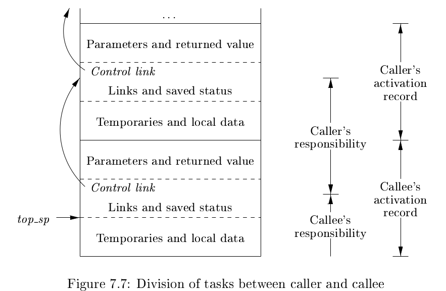

# 《编译原理》 day 51

今天是读《编译原理》的逻辑第 51 天，学习 activation trees（活动树）和 activation records（活动记录）。

活动树用来描述整个程序运行期间所有过程的活动，有点绕口，这时候只要上段代码就好了。

假设有这么一个快排算法，它有四个过程 main，readArray，quicksort，partition。

```
int a[11];
void readArray() {
    int i;
    ...
}
int partition(int m, int n) {
    ...
}
void quicksort(int m, int n) {
    int i;
    if (n > m) {
        i = partition(m, n);
        quicksort(m, i - 1);
        quicksort(i + 1, n);
    }
}
void main() {
    readArray();
    a[0] = -9999;
    a[10] = 9999;
    quicksort(1, 9);
}
```

那么它的其中一种可能的活动树长这样，之所以说可能是因为和 partition 的返回值有关


这里的 m = main，r = readArray，q = quicksort，p = partition 是四个过程的缩写，括号里面的是参数。

过程调用对应前序遍历活动树，过程返回对应后序遍历活动树，处于活动树某个结点 N，存活的活动是这个结点的祖先。

这种嵌套的关系，让栈来实现成为可能。过程 p 调用过程 q，那么 q 先结束活动，p 再结束，通常有三种情况

1. q 正常结束，控制回到 p 调用 q 的地方
2. q 终止，那么 p，q 同时结束
3. q 抛异常，如果 p 不能处理异常，p，q 同时结束，如果 p 能处理，那么 q 结束 p 继续

过程 p 叫做 caller，q 叫做 callee。

过程调用和返回通常由 control stack（控制栈）管理，每个存活的活动有一条位于控制栈中的活动记录，有时也叫 frame（帧），原来是你。

一条活动记录通常包含

1. 实参，放在寄存器中更加效率
2. 返回值，如果有的话
3. 控制链，指向 caller 的活动记录
4. 访问链，需要额外数据时使用
5. 保存的机器状态，用来恢复到调用前的状态
6. 局部数据，过程的局部数据
7. 临时值，计算过程中产生的中间值


快排执行过程中的活动记录


程序执行中不断有活动记录产生/消失，这里也解释了为啥递归有个最大深度。

Calling sequence（调用代码序列）实现过程调用，创建活动记录，return sequence（返回代码序列）恢复机器状态，caller 继续执行。

这部分实现差异很大，一般调用代码序列分成两部分，caller 实现一部分，callee 实现另一部分。

实现方式的一些原则

1. Caller 更懂实参，它来实现这部分更合适，实参最靠近 caller 的活动记录
2. 固定长度的项放在中间，通常是控制链、访问链、机器状态这些，能标准化机器信息更好
3. 不确定长度的项放在最后，比如动态数组啥的
4. 移动栈顶要特别小心，通常栈顶指针不是真的指向栈顶，而是指向活动记录中固定长度的末端

下面这种图是一种实现方式



图里有两个栈帧，实线的框，caller 计算实参，设置存放返回值的地址，把旧的 top_sp 存到控制链，然后递增 top_sp。Callee 接手填充剩下的部分，保存寄存器和状态信息，初始化局部变量并执行它自己的指令。

返回代码序列反过来，callee 填充返回值，恢复 top_sp、寄存器和状态信息，caller 知道返回值在哪里，毕竟是它自己设置的，然后继续执行指令。

对于不定长的数据，做法是活动记录不包含这部分数据，取而代之的是保存指向数据的指针，指针的长度是固定的。


嚯嚯，原来过程调用是这样的，原来只知道准备实参，保存寄存器，然后跳转指令，又张知识了。

封面图：Twitter 心臓弱眞君 @xinzoruo