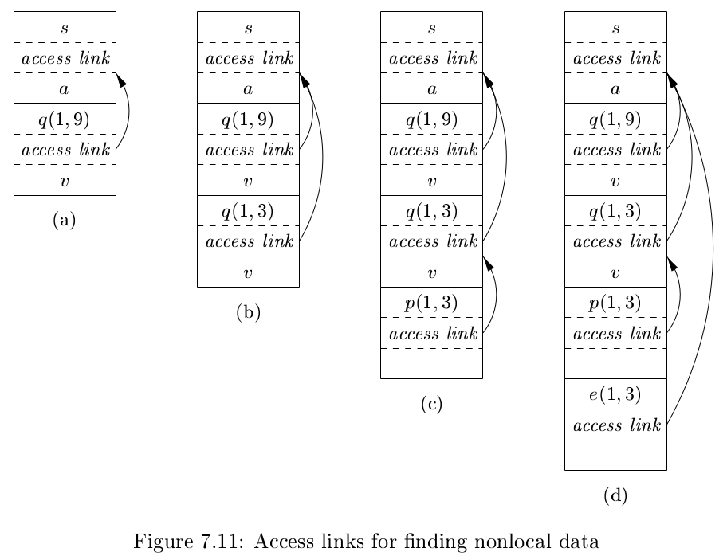
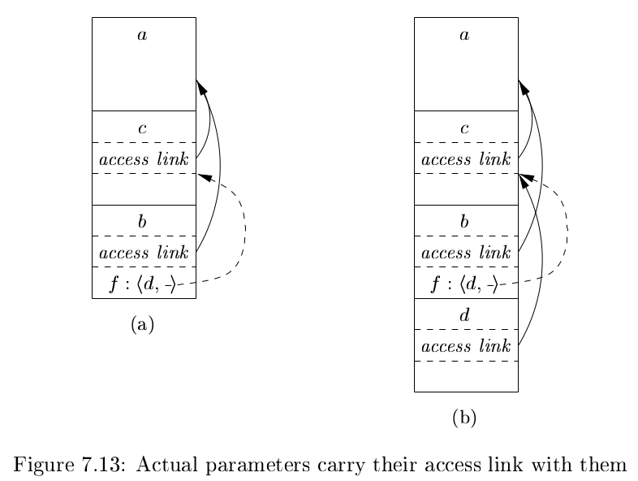

# 《编译原理》 day 52

今天是读《编译原理》的逻辑第 52 天，学习非局部数据的访问。

非局部数据比较常见的是全局变量，但根据作用域的静态规则，存在其他非局部数据，比如下面这样的

```java
void foo() {
    int outer = 2;
    class Bar {
        int bar() {
            int inner = 3;
            return inner + outer;
        }
    }
    int result = new Bar().bar();
    System.out.println(result);
}
```

这段代码虽然长得比较奇怪，但可以正常运行，输出 5。

这里的 outer 变量就是非局部数据，函数 bar 需要正确访问 outer 完成计算。

通常来说支持嵌套定义函数的编程语言，有这个这个特性。

函数的嵌套程度用嵌套深度衡量，最外面的函数嵌套深度是 1，之后每多一层嵌套深度 +1，上面的代码 n<sub>foo</sub> = 1，n<sub>bar</sub> = 2。

嵌套函数的作用域静态规则用 access link（访问链）实现，指向上一层函数的活动记录。

函数 q 调用函数 p，有两种情况

```
// case 1
func q() {
    func p() {}
    p();
}

// case 2
func r() {
    func p() {
        ...     func q() {
                    p();
                }
    }
}
```

1. 嵌套深度 n<sub>p</sub> > n<sub>q</sub>，这个情况下 n<sub>p</sub> = n<sub>q</sub> + 1 不然访问不到 p，java 和 js 我试过，确实是这样，多套一层就访问不到。这时候 p 的访问链指向 q 的活动记录，图示的 (a) 和 (c) 是这种情况
2. 嵌套深度 n<sub>p</sub> <= n<sub>q</sub>，从 p 开始，沿着访问链找 n<sub>q</sub> - n<sub>p</sub> + 1 次，p 的访问链指向这个地址，图示的 (d) 是这种情况。如果是递归调用，那么 p = q 访问链指向的活动记录也相同。图示的 (b) 是这种情况。

```java
Supplier sort = () -> {
    int[] a = new int[11];
    Consumer<Integer> readArray = (input) -> {
        a[0] = -9999;
        a[10] = 9999;
        for (int i = 1; i < 10; i++) {
            a[i] = new Random().nextInt(100);
        }
    };
    BiConsumer<Integer, Integer> exchange = (i, j) -> {
        int t = a[i];
        a[i] = a[j];
        a[j] = t;
    };

    class Quicksort {
        public void quicksort(Integer m, Integer n) {
            int v = a[n];
            BiFunction<Integer, Integer, Integer> 
            partition = (y, z) -> {
                int i = y - 1;
                for (int j = m; j < n; j++) {
                    if (a[j] <= v) {
                        i++;
                        exchange.accept(i, j);
                    }
                }
                exchange.accept(i + 1, n);
                return i + 1;
            };
            int i;
            if (n > m) {
                i = partition.apply(m, n);
                quicksort(m, i - 1);
                quicksort(i + 1, n);
            }
        }
    }
    readArray.accept(0);
    new Quicksort().quicksort(1, 9);
    return a;
}
```




除了显式指定函数名，还有更离谱的，把函数当参数传。

```java
Consumer<Integer> a = (x) -> {
    Consumer<Consumer<Integer>> b = (f) -> {
        f.accept(5);
    };
    Consumer<Integer> c = (y) -> {
        Consumer<Integer> d = (z) -> {
            System.out.println("d: " + z);
        };
        b.accept(d);
    };
    c.accept(1);
}
```

这段意义不明的代码也能正常执行，函数 b 的入参也是一个函数。

这种情况由 b 的调用者 c 负责确定访问链。函数 b 的活动记录保存 d 的访问链信息，这样 d 执行的时候能知道访问链指向哪里。



这尼玛实现这个特性费这么大劲，又感觉不常用，今天之前我都不知道函数体里面还能定义类的，而且这么写代码更像写 js 代码。

实际工作中写这样的代码，先不说逻辑对不对，感觉评审那一关不一定能过。

上面的 java 例子只说明它有嵌套定义这个特性，不代表 java 是这么实现的，书里用的 ML 语言演示，这个语言是纯函数式的，但我不会。

封面图：Twitter 心臓弱眞君 @xinzoruo