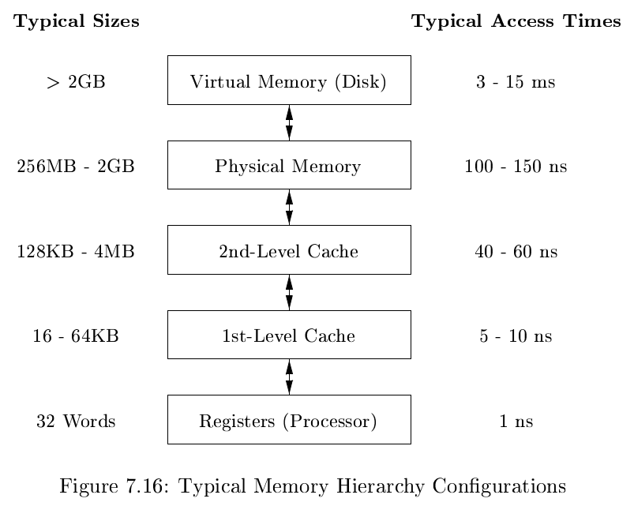
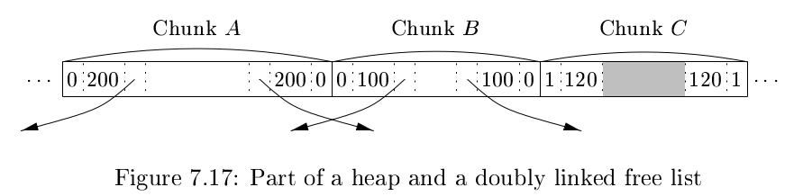

# 《编译原理》 day 53

今天是读编译原理的逻辑第 53 天，学习堆管理的子系统内存管理器。

堆存放生命周期不确定的对象，这让堆的管理比栈难上很多，栈对象的生命周期到函数返回就结束了。

内存管理器负责对象的分配和回收，有两个基本函数

1. Allocation: 为应用程序分配空间，如果可能的话使用已有的空闲块，不行就伸手向操作系统要，不给就报错
2. Deallocation: 回收应用程序不要的空间，有需要的话合并空闲块

高端的程序往往只有很少的函数，内存管理器需要具备

1. Space Efficience: 堆空间总量最小
2. Program Efficience: 合理分配保证应用程序运行效率高
3. Low Overhead: 分配回收时间 / 总时间，尽量小

存储的速度快、空间大、造价便宜不能共存，于是有了内存层次结构，计算机科学里总有那么多鱼与熊掌的故事。

磁盘和主存之间用 page（页）交换，通常 4k-16k，主存和缓存之间用 cache line（高速缓存线）交换，通常 32-256 字节。

大部分程序表现出局部性，分两类

+ Temporal locality: 访问过的位置在很短的时间内会再次访问
+ Spatial locality: 访问过的位置很可能访问它相邻的位置

程序花 90% 的时间执行 10% 的代码，有几个原因

1. 程序会包含很多不执行的指令。比如为了一两个函数引入的工具包，又比如项目迭代久了，遗留越来越多没用的代码
2. 只有很小部分代码真正被执行，不是有句话说 80% 的代码在处理异常逻辑
3. 程序将大部分时间花费在执行程序最内层循环和最紧凑的递归环上

程序的局部性可以更好的利用内存层次结构，缓存里通常放的都是最近访问过的块，有助于时间局部性。使用块作为传输单元，有助于空间局部性，访问地址相邻的数据也一并传输到更快的层次。

随着程序运行，不停地执行分配回收，堆空间被分割成若干个空闲块和使用块，这些不连续的空闲块叫做碎片，就像一个个小洞。

这些洞让空间使用率下降，就算有足够多的洞使得总大小满足分配的要求，内存管理器也只能去申请新空间，谁让人家要的是连续空间。

内存管理器通过适当策略减少碎片产生，best-fit 是其中一个，这个光听名字就知道它是把对象分配到满足条件的最小空闲块上。

为了更好得实现这个策略，空闲块按照大小分组，称为 bins（容器），容器内的空闲块按大小排序。

有一个特殊的块叫荒野块，这个块向操作系统申请空间。

容器使 best-fit 寻找空闲块更容易

1. 申请大小刚好对应容器，从容器中取任意一块
2. 申请大小不对应容器，选比它大一点的容器，从中选一块，拆分成两块，一块给应用程序，一块放到别的容器
3. 如果容器里没有空闲块，去大一点的容器里找一块能用的，最差的情况找荒野块要

Best-fit 有良好空间利用率，但是空间局部性不一定好。比如两个对象 a，b 先后申请空间，用 best-fit 策略，a, b 可能分配在天南地北。但根据空间局部性，访问 a 之后有很大概率会访问 b。

Next-fit 策略是 best-fit 的补充，条件允许的情况下，新的对象会分配在刚刚发生过分割的空闲块里。

对象被释放时如果相邻的块是空闲块则可以考虑接合

1. Boundary Tags: 每个块头尾划出一些字节用来保存块信息，是否空闲，块大小等
2. Doubly Linked, Embedded Free List: 隐式空闲列表，每个空闲块指向下一个空闲块，双向的。

回收空间时，看一下相邻的块是不是空闲的，是的话就可以合并，然后重新设定指针。

这部分《Computer Systems》第六章有更详细的介绍。

手动回收带来的问题

1. 未能删除不被引用的数据，造成内存泄露
2. 引用已经被删除的数据，称为 dangling-pointer-dereference（悬空指针引用）

程序员很难确定某个块在将来还会不会被引用，这种情况下大概率不删除数据，这种情况不会影响程序的正确性，只是时间久了内存被吃完，而且如果泄露量不大的话很难发现，重启大法好。

第二个问题更加严重，如果引用不到那还是小问题，弄不好被释放的块又被重新分配了，那还真能引用到，会产生难以解释的现象，不仅如此，发现问题的地方和实际导致问题的地方可能差了十万八千里，想想都觉得酸爽。

所以说嘛，要什么指针，没它说不定我大学还能多听几节课。

封面图：Twitter 心臓弱眞君 @xinzoruo