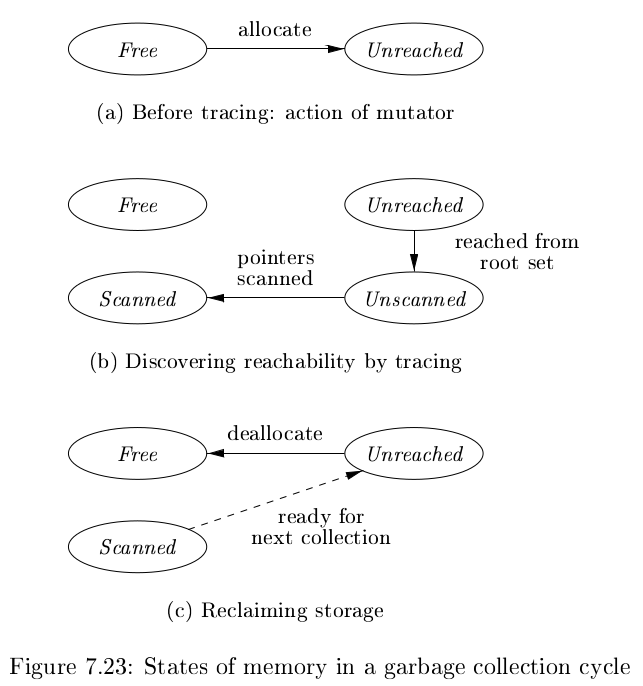
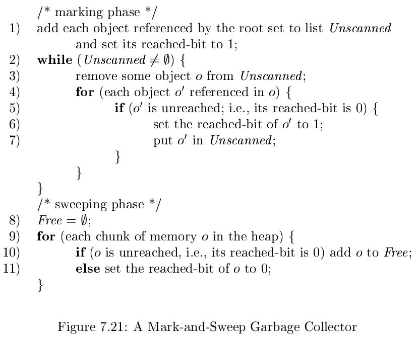
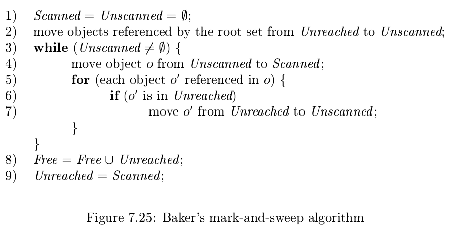
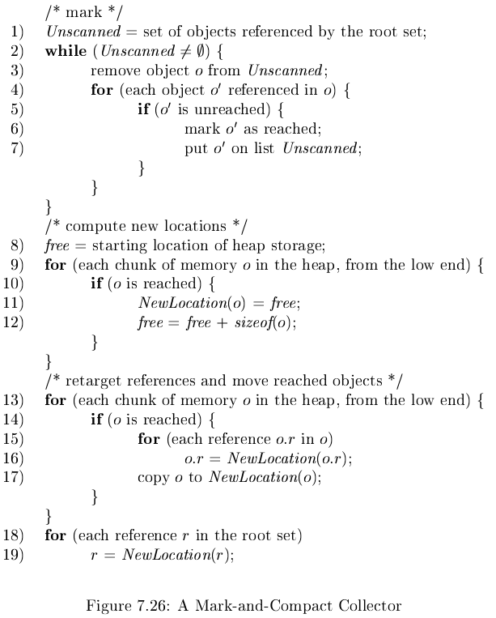
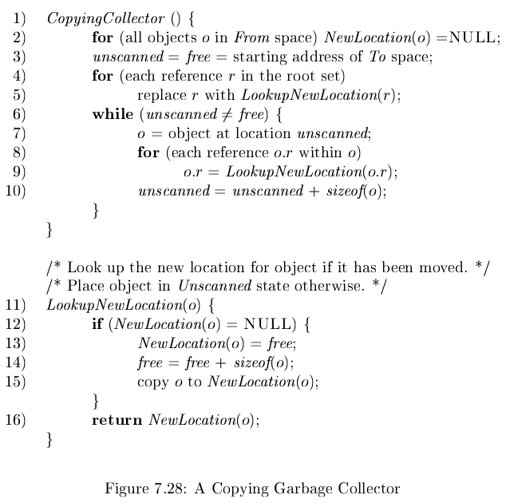

# 《编译原理》 day 55

今天是读《编译原理》的逻辑第 55 天，学习四个基于跟踪的垃圾回收算法，都是老面孔了。

内存块的四个状态

+ Free: 等待被分配的块
+ Unreached: 尚未建立可达性的块，初始分配或是一轮 GC 之后都处于这个状态
+ Unscanned: 内存块可达，但它的指针尚未遍历
+ Scanned: 内存块可达，指针已经被遍历

Unreached 有点别扭，其他都好理解，上面这四个既是状态也是集合。

**Basic Mark-and-Sweep**

这个算法有点像广度优先算法，遍历对象引用然后丢到 Unscanned，然后继续，可达性用对象保留的 1 bit 表示。

**Baker's Mark-and-Sweep**

优化的标记-清除算法，减少遍历对象。

GC 从 Unreached 提取 Scanned，这部分是可达对象，其余对象合并到 Free，Scanned 成为新的 Unreached，等待下一轮 GC。

**Basic Mark-and-Compact**

这个算法优化内存碎片，通过重新分配可达对象，提高增变者局部性。

使用 NewLocation(o) 保存新地址，可以是哈希表，也可以是别的数据结构。

这个算法巧妙的利用了对象新地址 <= 旧地址的特性，直接在原区域操作，又避免数据损坏，被覆盖的块不可能是将来需要重定位的块。

**Cheney's Copying Collector**

可能叫它标记-复制算法比较熟悉。它优化压缩算法需要遍历整个堆的问题，通过倒腾两个 semispaces（半空间）From 和 To 实现，一个保存分配的对象，另一个保持空闲，GC 后强制换岗。

复制算法新增 LookupNewLocation(o) 函数，负责在另一半生成新地址。

这样做的好处是只遍历可达对象就能完成类似压缩算法的效果，代价是浪费一些空间。

两个指针 unscanned 和 free 很妙，unscanned 追上 free 的时刻就是遍历完成时刻，这种小细节让人欲罢不能，算法还是有魅力。

有两种对象对这个算法不友好，一种是特别大的对象，拷贝费劲，另一种是命特别硬的对象，每次拷贝都有它，刚好对应 java 进入老年代的两个条件。

网上总说互联网技术更新迭代快，也不尽然嘛。龙书是 96 年出版的，二十多年过去了 GC 还是这个思路。

封面图：Twitter 心臓弱眞君 @xinzoruo