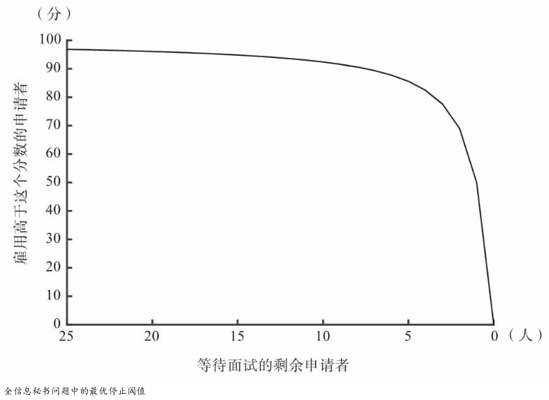
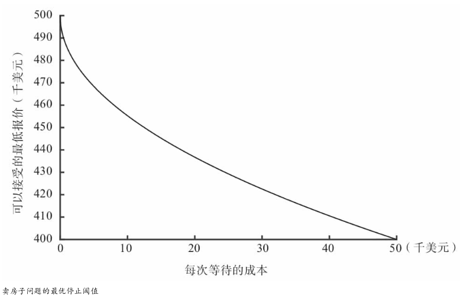

# 《算法之美》 day 1

*注：这本书和算法没关系*

前几天在[阮一峰的科技爱好者周刊](https://mp.weixin.qq.com/s/-FUPkFZRNvUaawwaHsu-Dw)看到一本书，发现很合适我，这是一本介绍生活中数学知识的书，刚好我就在找类似的书籍。

另外这本书面向普通读者，没有任何公式和代码，这对阮老师来说是缺点，但对我来说刚好合适，它要真给了公式和代码，我也看不懂，有趣有用就够了。

这里插个 flag，过年期间刷完这本书。

阮老师的文章里已经很好解释了秘书问题和 37% 法则，这里补充几个变种。

秘书问题假设应聘者不会拒绝，不会邀请之前的应聘者，如果这两个条件变化，需要适当提前或者延后。

如果应聘者有一半概率拒绝，那么需要提早到 25%，如果允许邀请之前的应聘者，但有一半概率拒绝，那么可以推迟到 61%。

秘书问题还一个有意思的点，使用 37% 法则最终选到最优候选人的概率也是 37%，奇妙的对称性，当然这也意味着有高达 63% 的概率选不到最优候选人。

另一类最佳停止问题，假设掌握了候选对象所有信息，这时候可以使用**阈值准则**，有两个例子。

一个还是应聘秘书，此时每个秘书都有战斗力得分，眼镜照一下就能知道，战斗力 90 的肯定比战斗力只有 5 的强。

这时候可以绘制申请者战斗力和剩余申请者的关系图

只要申请者战斗力超过阈值，直接邀请，同时阈值随着剩余申请者的减少而减少，临近最后更是直线下降。

另一个例子是卖房子，它假设每次拒绝需要支付代价，很正常还贷款嘛。

这时候可以绘制报价和等待成本的关系图

报价合适，直接成交，不用考虑第几次报价。

第一章看下来，我的理解是对于自己熟悉的领域，做决策要有个底（阈值），对于自己不了解的领域，花 37% 时间调研，然后做决策。

距离假期结束还有十天，算了下一共 200 页，一天要看 20 页，看起来好像似乎或许大概貌似够用。

封面图：Twitter 心臓弱眞君 @xinzoruo