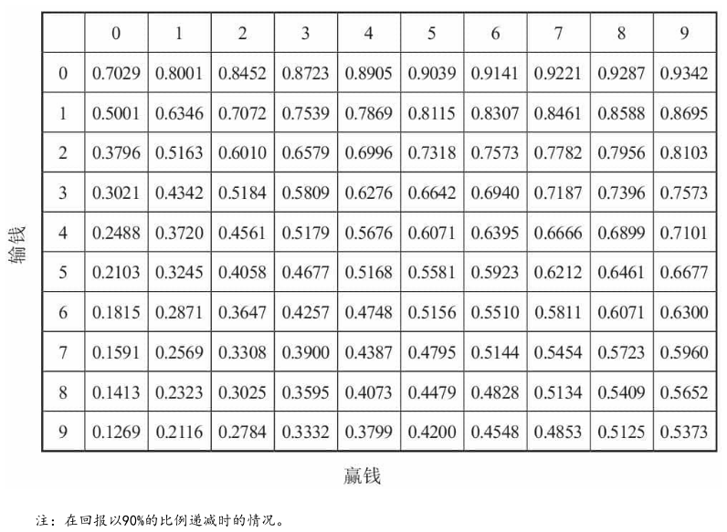
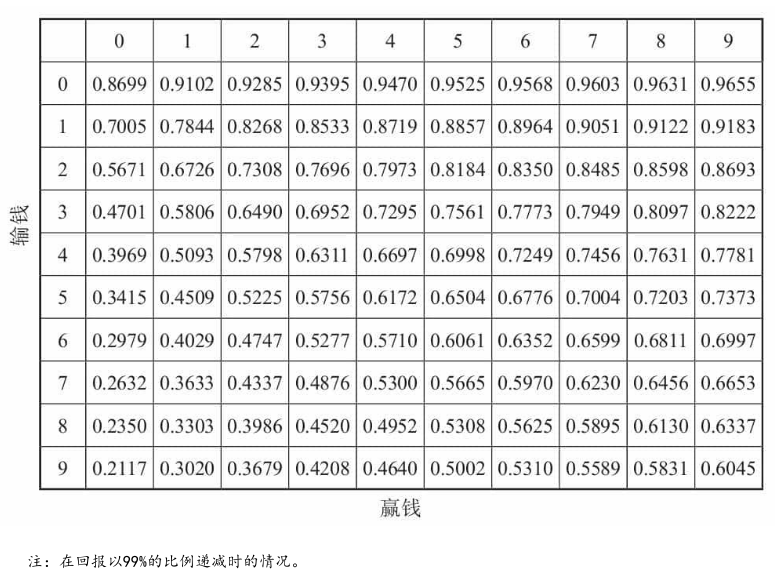

# 《算法之美》 day 2

*注：这本书和算法没多大关系*

今日问题：探索和利用，选择最新的还是最好的。

很可惜，这个问题没有像最佳停止问题一样有个简单用得上的答案。

日常中时常面临选择，选择听新歌还是旧歌单，选择一家新外卖，还是点以前吃过最棒的那家，选择学习新的编程语言，还是 java 用用算了。

这些问题在数学也有个叫法，叫「多臂老虎机问题」[1]。

假设一家赌场，有两台老虎机，老虎机吐钱的概率是固定的，但是不知道是多少，问如何玩让收益最大化？

首先肯定两台机子都摇摇看（探索），然后根据结果摇那台容易吐钱的（利用）。

如果一号机摇出 9 赢 6 输 (9-6)，二号机摇出 1-1，接下来摇哪台？

这问题搁我就直接摇一号了，而且我要吐槽下，尼玛是怎么摇出这么大差距的，一号机的摇杆涂了 502 是吧，但老哥作为数学家就是不一样，利用经济学贴现（当下收到 100 比将来收到 100 更值钱）的概念，假设奖励按几何级数衰减，经过一操子牛逼操作算出来一个基庭斯指数[2]。

下面两张图是回报按 90% 递减和 99% 递减时的基庭斯指数

无论参考哪张图 1-1 的基庭斯指数都高于 9-6，更有选择的价值。

这个解法日常基本没法用，等把基庭斯指数算出来，黄花菜都凉了。

虽然没有用，但能从中获得一些启发。

0-0 的指数大于绝大多数，浅尝一下说不定有惊喜。

对比两张图，同样的格子，99% 衰减的指数比 90% 衰减的大不少，是不是意味着低衰减的事更值得探索。从这个角度来看阅读、写作都是价值衰减很小的习惯，很值得尝试，以前只是听大佬这么建议，这下直接有数学理论支持了。

反过来说，游戏，短视频这些价值衰减比较厉害的事是不是得少做，我去问下手同不同意。

总的来看，年轻时多探索，等大半截身子入土了，可以考虑享受享受。

参考链接

+ [1] 多臂老虎机：*https://en.wikipedia.org/wiki/Multi-armed_bandit*
+ [2] 基庭斯指数：*https://en.wikipedia.org/wiki/Gittins_index*

封面图：Twitter 心臓弱眞君 @xinzoruo