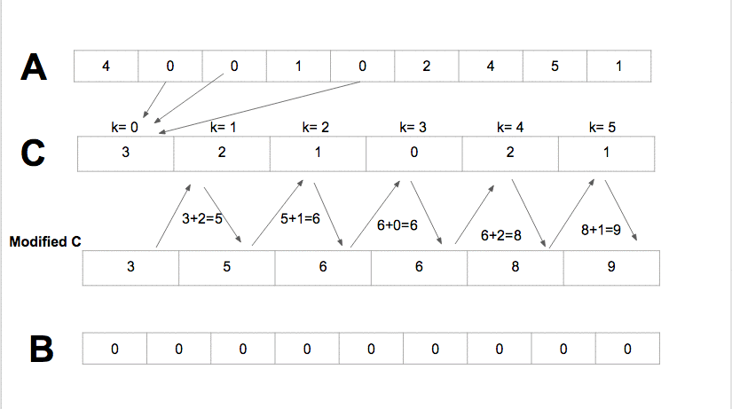

# 《算法之美》 day 3

*注：这本书和算法关系不大*

今天的两章比较熟悉，排序和缓存。

<!-- 这两个技术都是为了更高效，

缓存没啥好说的，只要记住 LRU 这个简单又有效的策略就够了。 -->

每次出现排序，冒泡法总要出来挨打，这次也是，当奥巴马被问到排序问题时，他回答首先排除冒泡排序。

常规的排序没啥说的，估计都背了好多遍了，我印象比较深的是一个诡异的排序，忘记哪本书上看到，好像是《编程珠玑》吧。

它把数组的元素当另一个数组的下标，比如数组 `A = [6, 4, 1, 3]` 那么 `T[6] = 1; T[4] = 1` 等等，然后遍历数组 T 取出值为 1 的数组下标，排序就完成了。

总觉得哪里不对劲，但好像又没错。

后来发现这还真是正经的排序算法，和猴子排序这种搞笑的不一样。

这类算法和传统基于比较的排序算法不同，能够突破 O(n·log n) 的限制，种类还不少。

**桶排序[1]**

这个怎么看都和归并排序有点像

**计数排序[2]**

**基数排序[3]**

书里提到算法的健壮性挺有意思的，它指的是在每次比较有一定概率出错的情况下，最终结果的准确性。

比如现实中的体育比赛，只要双方差距不是大的离谱，总有爆的概率，这时候需要平衡效率和健壮性。

在强调健壮性时，冒泡排序终于熬出头了，按着归并排序摩擦。

排序还有个例子蛮有意思的，图书馆图书，这个例子要和缓存一起。

对图书的排序是为了更方便的找到这本书，但不是每本书被借阅的概率都相同，总有些书是热门的，一些书是万年冷板凳。

这时候把归还的书放回它原本的位置是否真的更有效。

根据 LRU 这个简单又有效的

排序可能会让检索的代价更大，它把本该放在缓存的位置放回了它原始的位置

想尽办法缩短排序的时间，实际上导致了更差的检索效果，因为缓存没了

衣柜比喻缓存

衣柜也按层级分

冬天的时候收起夏天的衣服

正在看的书放床头，一般想看的书在书架，其他的书在当当、多抓鱼。

手机这种一天不知道要访问多少次的直接贴身带。

+ [1] 桶排序：*https://en.wikipedia.org/wiki/Bucket_sort*
+ [2] 基数排序：*https://en.wikipedia.org/wiki/Radix_sort*
+ [3] 计数排序：*https://en.wikipedia.org/wiki/Counting_sort*

封面图：Twitter 心臓弱眞君 @xinzoruo