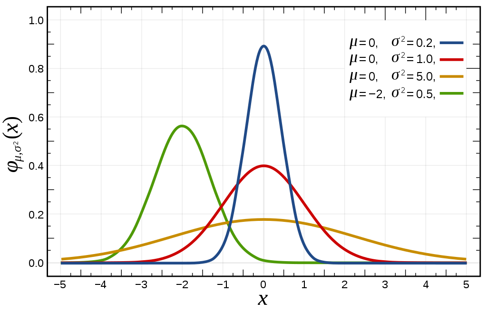
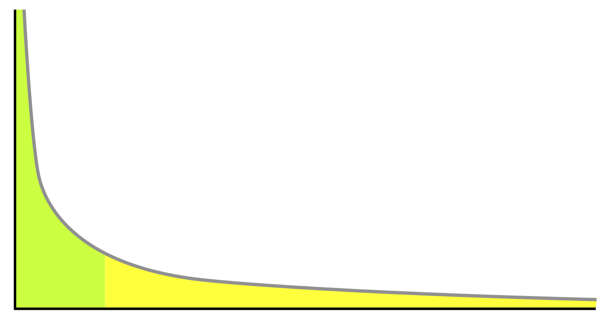
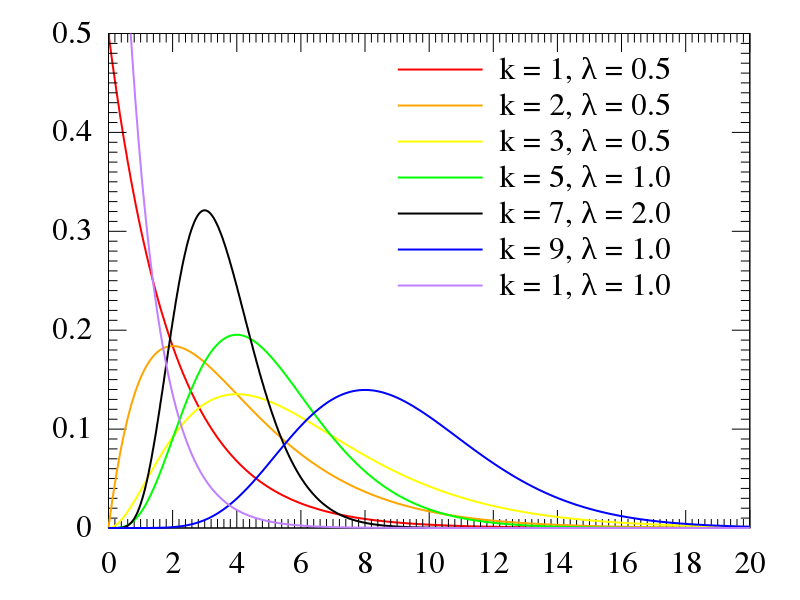

# 《算法之美》 day 5

今日内容：贝叶斯法则

大概是这么个公式

$$
P(A | B) = \frac{P(B | A) * P(A)}{P(B)}
$$

P(A | B) 是条件概率，表示事件 B 发生时，事件 A 发生的概率。

举个例子，有两枚硬币，一枚有诈，两面都是菊花，随机拿一枚投掷，结果是菊花，问这是正常硬币的概率有多大。

```
A: 拿出的是正常硬币
B: 结果是菊花

P(B | A) = 1 / 2
    P(A) = 1 / 2
    P(B) = 3 / 4

代入公式 P(A | B) = 1 / 3
```

垃圾邮件过滤是贝叶斯法则的一个应用，它求的是出现某个关键词的邮件是垃圾邮件的概率。计算需要的概率通过统计获得，样本量越大越准。

这么来看也能理解为啥不让访问推特、油管和脸书。

那如果不知道概率怎么办，刚好有个拉普拉斯定理<sup>[1]</sup>估算概率

$$
\frac{w + 1}{n + 2}
$$

w 是事件发生的概率，n 是试验总次数。

应用贝叶斯法则，不同分布的数据有不同的预测方法。

**正态分布<sup>[2]</sup>**



上学的时候就觉得这名字很怪，直到看到它的英文 normal distribution，啊哈，原来是这个意思。

这种分布平均值有意义，使用平均法则预测。

中国人均寿命 77.93<sup>[3]</sup>，那预测自己 78 寄了很合理，多活一年就是血赚。

**幂律分布<sup>[4]</sup>**



幂律分布有个巨大的头和很长的尾巴，类似常说的二八原则。

忘记哪里看到一句话，说的应该是这种情况。

> 凡有的，还要加给他，叫他有余；凡没有的，连他所有的，也要夺去。

这种分布平均值很有欺诈性，甚至不如中位数有用，比如人均可支配收入￥36883<sup>[5]</sup>。

幂律分布使用相乘法则预测，预测值 = 观察值 * 常量。

**厄兰分布<sup>[6]</sup>**



<!-- 这个分布有点像歪了的正则分布。 -->

厄兰分布使用相加法则预测，预测值 = 观察值 + 常量，有句台词很应景。

> 明明说好是三年，可三年之后又三年，三年之后又三年，就快十年了老大！

很显然老大在用相加法则预测（笑）。

不过去年听的最多的建议是不预测，只应对，可能 2022 年实在是太……魔幻了。

+ [1] 拉普拉斯定理：*https://en.wikipedia.org/wiki/Rule_of_succession*
+ [2] 正态分布：*https://en.wikipedia.org/wiki/Normal_distribution*
+ [3] 平均年龄：*https://data.stats.gov.cn/easyquery.htm?cn=C01 指标 》人口 》人口平均预期寿命*
+ [4] 幂律分布：*https://en.wikipedia.org/wiki/Power_law*
+ [5] 居民收入：*http://www.stats.gov.cn/xxgk/sjfb/zxfb2020/202301/t20230117_1892129.html*
+ [6] 厄兰分布：*https://en.wikipedia.org/wiki/Erlang_distribution*

封面图：Twitter 心臓弱眞君 @xinzoruo