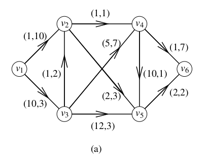
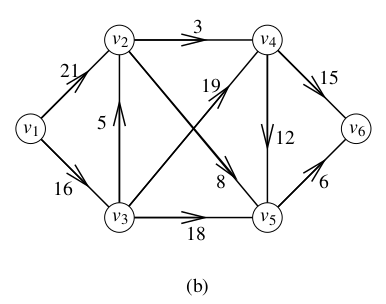

# 《算法之美》 day 6

今日内容：松弛

松弛说的是一些最优解问题，如果很难，不妨先放开部分条件，求个次优解。

**拉格朗日松弛算法**[1]

它的理念是把约束条件转化为代价，举个例子

图 a 每条边关联一对属性 (ce, te) 分别表示距离和时间，求 v1 到 v6 满足总时间小于 T 的最短路径。

这个问题要是能把时间干掉，那就是最短路径问题，刚好拉格朗日松弛就是干这事的。选取合适的 μ = 2 把时间作为距离的代价

(ce, te) 转化为 ce + μte

后面就简单了。

还有旅行商问题[2]，很久之前听过它的大名，没太多印象，就知道它很难，非常难。

每次出门旅游就是解一次旅行商问题，规划一条路线，从酒店出发，打卡全部景点，然后回到酒店，最好走路少，不走回头路（如果有的选，我选择宅家）。

它也能用拉格朗日松弛解，但又和线性代数有关，见了鬼了。

除了拉格朗日松弛还有**约束松弛**和**持续松弛**。

约束松弛更暴力，直接消除部分约束。持续松弛把离散值调整为连续值，比如 0.6 人这样的，最后再转回离散值。

无论哪种都强调解决问题，这个解可能不是最优的，但总比没有解要好。

现实也是如此，在各种限制下解决问题，解决比最优更关键。

解了三年的梦魇以另一种方式解决了，或者说变换了。

+ [1] 拉格朗日松弛算法：https://en.wikipedia.org/wiki/Lagrangian_relaxation
+ [2] 旅行商问题：https://en.wikipedia.org/wiki/Travelling_salesman_problem

今年海灯节好棒，归终是指望不上了，但萍姥姥和那个女人赶紧安排上啊米忽悠。

封面图：Twitter 心臓弱眞君 @xinzoruo