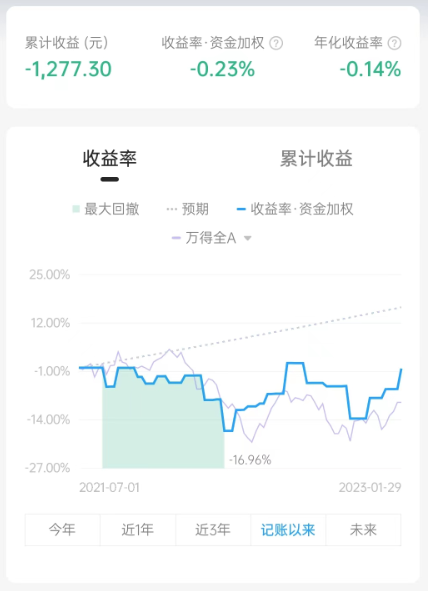
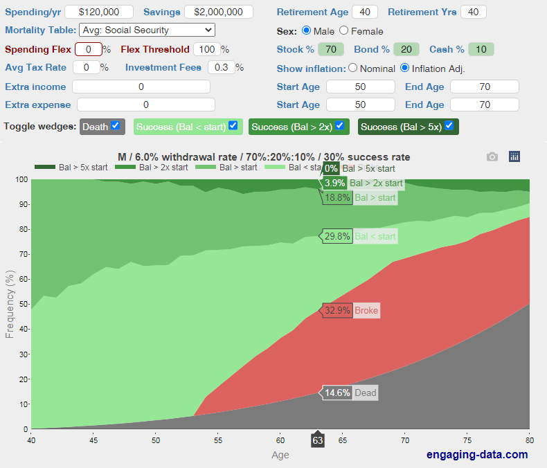
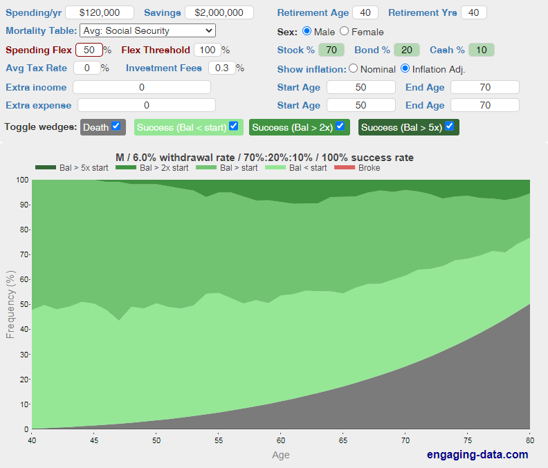
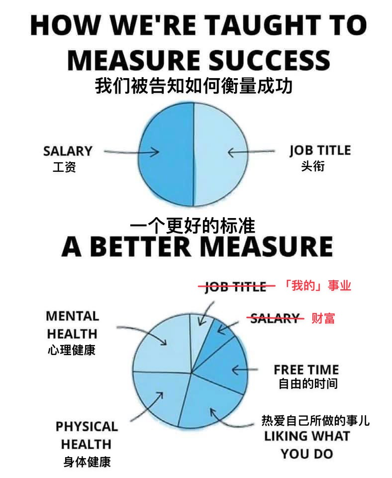

# 年终总结

时间过得好快，转眼 23 年已经过去一个月了，正好回顾一下 FIRE(Financial Independence, Retire Early) 进度。

今年是萌生提前退休想法的第三年，回顾之前的计划还有很多不成熟的地方

按照现在的平均寿命，按国家规定退休那时遥遥无期，现在平均寿命都到 78 了，退休年龄推迟到 70 也不是不可能。

退休这个事指望国家是指望不上了，现在是 65。

再苦一苦百姓，推迟到 70 也不是不可能，毕竟现在平均寿命女的都 80 了，男的也有 77，而且还在上涨。

这个计划我和一个朋友聊过，那狗日的表示才 200万，我两三年就够了，嘴脸太丑恶了，这聊天记录我要留到入土。

去年开销超出预算，还超挺多的，我个人的账单看了下车子是真费钱，占了总支出的 37%，绝大多数是停车费。

我买车属于 49 年入国军，要是玩几年我一定选五菱宏光，我现在逢人就劝别买车。

回顾 21 年 9 月的计划，发现当时的计划还是挺粗糙，现在回头看都有点看不懂了，只写了个 2027。

正好趁这次机会重新盘一盘。

盘之前把从也大哪里牛过来的两个工具翻出来[投资计算器](https://mp.weixin.qq.com/s/T7d_F4xb71gApjssqeWjcQ)和[破产计算器](https://mp.weixin.qq.com/s/gN7O30L_uezAMCFjlVDAAw)

投资计算器计算积累到退休目标所需的时间和月投入金额。

破产计算器计算开始退休生活破产的概率。

21 年的笔记只留了张截图，还少了半截，好在根据年度计划可以反推，反推出来的金额是 11515，怎么是这么诡异的金额。

我完全没有印象，在我的记忆里一直是 7500，而且那时候我这么激进的么，这个投入金额我差不多每月只能吃土。

在根据金额重新算了一遍投资时间为 5.886 年，约 5 年 11 个月，那么从当时的角度看应该是 2027 年 8 月。计算的初始日期已经不知道了，就按照笔记的创建时间来推算。

这个时间基本吻合我脑袋里一直记得是 2027 年。

然鹅我今天重新演算发现要到 2027.10 才能实现，一年多执行下来没提早，反而是延期了。

想来也正常，我设定的回报率是 10%（说明当时确实激进），实际现在是

这个故事告诉我，努力是不一定有结果的，不努力最多也就是零，努力了，还可能是负数。

这个图里的灰色区域就是人生最痛苦的事情：人死了 钱没花了

这个图里的红色区域就是人这一生最最最痛苦的事：人活着呢 钱没了

给年度支出 50% 的灵活度之后红色区域就没有了，这意味在行情不好的年份需要节省开支，保持余额在初始金额之上，

年度预算在 6-12 之间，

当然这些都是理想状况，实际执行起来一定会有各种各样的问题，这时候就需要[风叔](https://mp.weixin.qq.com/s/VlOAixs3ixCvhNvF_EYn3g)的灵魂三问。

只要下定决心去做了，那问题都不是问题。

在理财这条路上最重要的因素是时间，现在想想大学是真的亏，窝在寝室打了四年游戏，前几天这游戏还退出中国了。

毕业了也是浑浑噩噩，随波逐流，浪费了大把大把时间。不过我本来就比别人迟钝一点，当别人都在用 3G, 4G 的时候，我还在用 2G，以至于在一个重要的会面，因为网太卡打不到滴滴，场面一度非常尴尬，这事还老被拿出来鞭尸。

也就是那一次，我回去就把我珍藏的 2G 换成了 4G，当然不出意外的我现在也没用 5G。

决定赚多少的确实是本金，但交学费试错那是本金越小越好。

但反过来往好的方面想，万一以后起飞了呢，说不定再有有限的一生里，我现在说不定也是小本金阶段，梦还是要有的。

这次应该是写详细了，来年再来看，有没有缺的，flag 已经插下，坐等 2027 年回收。

最后再附上一张从也大那边牛来的图

经历过计划生育，我对呼吁早婚早育，二胎三胎一律屏蔽。

当年把我兄弟姐妹都搞掉了，现在还好意思舔着脸回来，做梦吧

破产计算器：https://mp.weixin.qq.com/s/gN7O30L_uezAMCFjlVDAAw
计划计算器：https://mp.weixin.qq.com/s/T7d_F4xb71gApjssqeWjcQ
灵魂三问：https://mp.weixin.qq.com/s/VlOAixs3ixCvhNvF_EYn3g

封面图：Twitter 心臓弱眞君 @xinzoruo