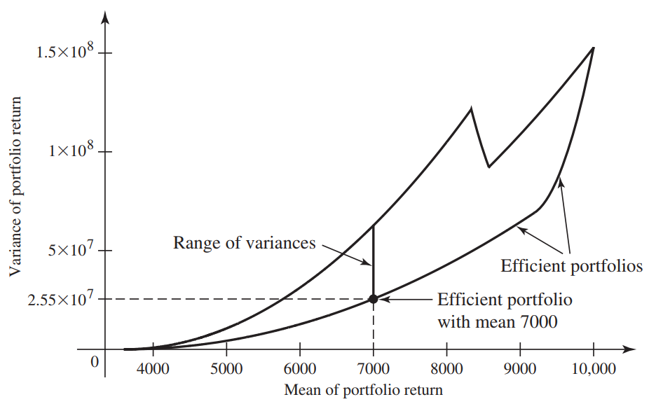

# 《概率统计》 day 17

今天是读《概率统计》的逻辑第 17 天，学习期望和方差

<!-- 介绍 Y = r(X) 时，E(Y) 和 E(X) 的关系。 -->

根据定义方差也是一种期望 $Var(X) = E[(X - E(X))^2]$。

|一些定理                                                             |前提条件                  |
|--                                                                  |--                        |
|$E(Y) = aE(X) + b$                                                  |$Y = aX + b$             |
|$E(X) = c$                                                          |$P(X = c) = 1$           |
|$E(\sum_{i=1}^nX_i) = np$|$X_i$ 是二项式分布(n, p)|
|$E(\sum_{i=1}^nX_i)=\sum_{i=1}^nE(X_i)$                             |  |
|$E(\prod_{i=1}^n X_i) = \prod_{i=1}^nE(X_i)$                        |$X_i$ 独立                |
|$Var(X) = E(X^2) - [E(x)]^2$                                        |                          |
|$Var(Y) = a^2Var(X)$                                                |$Y = aX + b$              |
|$Var(\sum_{i=1}^n X_i) = \sum_{i-1}^n Var(X_i)$              |                          |
|$Var(\sum_{i=1}^n a_iX_i) = \sum_{i=1}^n a_i^2Var(X_i)$|                          |
|$Var(\sum_{i=1}^nX_i) = np(1-p)$                                                  |$X_i$ 是二项式分布(n, p)   |
|$E(X) = \sum_{n=1}^{\infty}P(X \ge n)$|X = 0, 1, 2, ...|
|$E(X) = \int_{0}^{\infty}[1-F(x)]dx$|X 非负随机变量|

倒数第二个定理的证明有点东西，写一个三角形阵列

$$
\begin{aligned}
& P(X = 1) & P(X = 2) & P(X = 3) & \dots \\
&          & P(X = 2) & P(X = 3) & \dots \\
&          &          & P(X = 3) & \dots \\
&          &          &          & \ddots
\end{aligned}
$$

阵列按行求和 $\sum_{n=1}^\infty P(X \ge n)$ 按列求和 $\sum_{n=1}^{\infty}nP(X=n)$，又因为他们计算的是一个东西，所以相等

根据期望定义

$$
E(X) = \sum_{n=0}^{\infty}nP(X=n) = \sum_{n=1}^{\infty}nP(X=n)
$$

so 证明完成。

这定理可以用来算抽卡期望，假设抽到五星的概率是 p，那么 $P(X \ge n) = (1-p)^{n-1}$

对应的期望就是 $E(X) = \sum_{i=1}^n (1-p)^{i-1} = \frac{1}{p}$

总觉得哪里不对劲，又说不上来。

不过期望什么的已经无所谓了，作为一个非酋，眼里只有大保底。

好像知道平均收入不靠谱的地方了，期望应该是加权平均，而现实通常是灯权平均。

怪不得我和马云平均上亿，靠谱的算法应该是 $E = f(x = me) * P_{me} + f(x = jack.ma) * P_{jack.ma}$ 才对


投资组合

有两只股票

|回报|价格|期望|方差|
|--|--|--|--|
|$R_1$|60|$E(R_1)=6$|$Var(R_1)=55$|
|$R_2$|48|$E(R_2)=4$|$Var(R_2)=28$|

另外定期利率是 3.6%

投资组合 ($s_1, s_2, s_3$) 总金额 $60s_1 + 48s_2 + s_3$ 固定 100000。

组合收益 Y = $s_1R_1 + s_2R_2 + 0.036s_3$

$E(Y) = E(s_1R_1 + s_2R_2 + 0.036s_3) = 6s_1 + 4s_2 + 0.036$

$Var(Y) = 55s_1^2 + 28s_2^2$

所有 $s_1, s_2, s_3$ 取值组成下面这个大砍刀形状



只能说很强，投资组合还可以这样玩。

从图看同样的期望方差不同，越小稳定，所以要选就选大砍刀刀刃部分，果然好钢都要用在刀刃上。

同时期望越大，方差越大，挺符合只觉得，想赚得多，就要接受大起大落的风险。

好奇为什么 8000 附近会有一个断崖式下降

（不知道咋算的，难道大力出奇迹）

```python
import matplotlib.pyplot as plt
cash = 100000
def e_y(s1, s2, s3):
    return 6 * s1 + 4 * s2 + 0.036 * s3
def var_y(s1, s2):
    return 55 * s1 * s1 + 28 * s2 * s2
x = []
y = []
s1 = 0
while 60 * s1 <= cash:
    s2 = 0
    while 48 * s2 <= cash - 60 * s1:
        s3 = cash - 60 * s1 - 48 * s2
        x.append(e_y(s1, s2, s3))
        y.append(var_y(s1, s2))
        s2 += 1
    s1 += 1
plt.scatter(x, y, s=0.01)
plt.xlabel('E(Y)')
plt.ylabel('Var(Y)')
plt.show()
```

Interquartile Range(IQR)

$$
IQR = F^{-1}(0.75) = F^{-1}(0.25)
$$


封面图：Twitter 心臓弱眞君 @xinzoruo