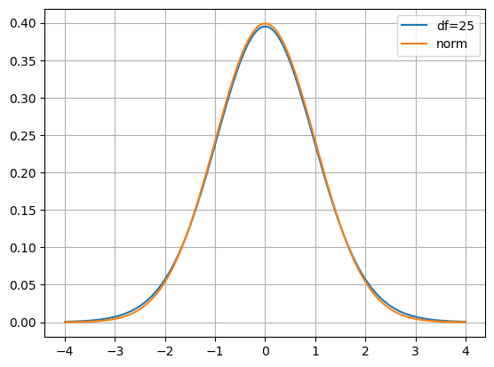

# 《概率统计》 day 33

今天是读《概率统计》的逻辑第 33 天，学习置信区间。这一天天的，越来越抽象了。

上一节最后的 t 分布

$$
U = \frac{\sqrt{n}(\overline{X} - \mu)}{\sigma'}
$$

假设 n = 26 那么这个 t 分布（蓝线）就确定了，和标准正态分布（橙线）非常接近。

```
import numpy as np
import matplotlib.pyplot as plt
from scipy.stats import t
from scipy.stats import norm

x = np.linspace(-4, 4, 1000)
y_t = t.pdf(x, df=25)
y_norm = norm.pdf(x)

plt.plot(x, y_t, label=f'df=25')
plt.plot(x, y_norm, label=f'norm')
plt.legend()
plt.grid(True)
plt.show()
```



根据 $P(|U| \lt c) = \gamma$ 解出 $c = T_{n-1}^{-1}[(1 + \gamma) / 2]$ 那么 $|\sqrt{n}(\overline{X}_n - \mu)/\sigma'| \lt c$。

$\mu$ 的下限 $A = \overline{X}_n - \frac{\sigma'}{\sqrt{n}} T_{n-1}^{-1}[(1 + \gamma) / 2]$

$\mu$ 的上限 $B = \overline{X}_n + \frac{\sigma'}{\sqrt{n}} T_{n-1}^{-1}[(1 + \gamma) / 2]$

范围 $(A, B)$ 就是系数 $\gamma$ 的置信区间。

假设 $\gamma = 0.95$ 算出 $c = 2.06$

$A = \overline{X}_n - 0.404\sigma'$

$B = \overline{X}_n + 0.404\sigma'$

置信区间说的是 $\mu$ 在 (A, B) 的概率是 95%，一次抽样后就能算出具体的 (a, b)，但不能认为 $\mu$ 在 (a, b) 的概率是 95%，(A, B) 相当于随机变量，(a, b) 是其中一个值。

这就比较坑了，那该怎么使用？

计算置信区间需要先找到 pivotal quantity 似乎翻译成枢轴变量，它是一个随机变量，对所有 $\theta$ 取值，分布一致。

比如正态分布

$$
V(\vec{X}, \theta) = \sum_{i=1}^n((X_i - \overline{X}_n)^2/\sigma^2)
$$

对所有 $\theta = (\mu, \sigma^2)$ 都是 n - 1 的 $\chi^2$ 分布，这个枢轴变量可以用来计算 $\sigma^2$ 的置信区间

同样

$$
V(\vec{X}, \theta) = \sqrt{n}(\overline{X}_n - \mu)/\sigma'
$$

对所有 $\theta$ 都是 n - 1 的 t 分布，这个枢轴变量可以用来计算 $\mu$ 的置信区间。

如果 $\theta$ 是标量更容易，比如参数为 $\theta$ 的指数分布

$$
V(\vec{X}, \theta) = \theta \sum_{i=1}^n X_i
$$

对所有 $\theta$ 都是 (n, 1) 的伽马分布，可以用来计算 $\theta$ 的置信区间。

碎碎念

几周前公司从城东搬到了城西，通勤时间飙升 200%，幸福指数就和大 A 一样天天阴跌。唯一好处是外卖送的真快，不到二十分钟就送达，以至于要在外卖柜里躺上半小时。

封面图：Twitter 心臓弱眞君 @xinzoruo