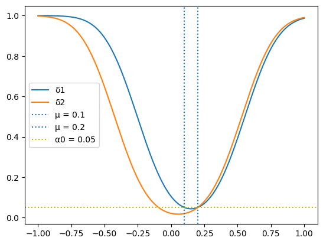

# 《概率统计》 day 40

今天是读《概率统计》的逻辑第 40 天。

这几节看下来，似乎 $\delta$ 才是假设检验的核心。除了第一节海量概念，第二节找让 $\alpha(\delta), \beta(\delta)$ 最小的 $\delta$，第三节找 UMP $\delta$，这节还是找 $\delta$，形式变为：如果 $T \le c_1$ 或 $T \ge c_2$ 拒绝 $H_0: \mu_1 \le \mu \le \mu_2$。

因为是区间，c 也不再只有一个，从解方程改为解方程组

$$
\begin{cases}
\pi(\mu_1|\delta) = \alpha_1 \\
\pi(\mu_2|\delta) = \alpha_2
\end{cases}
$$

$\alpha_1 \le \alpha_0, \alpha_2 \le \alpha_0$

比如 $N(\mu, 1)$ 的正态分布 $X_i$ 选 n = 25 个样本

$$
H_0: 0.1 \le \mu \le 0.2
$$
$$
H_1: \mu \lt 0.1, \ \mu \gt 0.2
$$

显著性水平 $\alpha_0$ 的 $\delta$：如果 $\overline{X}_n \le c_1$ 或者 $\overline{X}_n \ge c_2$ 拒绝 $H_0$

$$
\begin{aligned}
\pi(0.1|\delta) &= P(\overline{X}_n \le c_1|\mu=0.1) + P(\overline{X}_n \ge c_2|\mu = 0.1) \\
&= \Phi[\sqrt{n}(c_1 - 0.1)] + \Phi[- \sqrt{n}(c_2 - 0.1)]
\end{aligned}
$$

$$
\begin{aligned}
\pi(0.2|\delta) &= P(\overline{X}_n \le c_1|\mu=0.2) + P(\overline{X}_n \ge c_2|\mu = 0.2) \\
&= \Phi[\sqrt{n}(c_1 - 0.2)] + \Phi[- \sqrt{n}(c_2 - 0.2)]
\end{aligned}
$$

理论上有无限种 $c_1, c_2$ 可选，和 $\alpha_1, \alpha_2$ 取值有关。

如果取 $\alpha_1 = \alpha_2 = 0.05$ 那么 $c_1, c_2$ 以 $\mu = 0.15$ 对称

$c_1 = 0.15 - c$, $c_2 = 0.15 + c$

解方程 $\Phi[5(0.05 - c)] + \Phi[-5(0.05 + c)] = 0.05$

```
rv = norm()

def f(c):
    return rv.cdf(5 * (0.05 - c)) + rv.cdf(-5 * (0.05 + c))

def g(c):
    return f(c) - 0.05

y = g(x)

optimize.newton(g, 0.4)
```

先对 g(c) 作图，看到 g(c) = 0 大概在 0.4 附近，初始猜测 0.4，牛顿法会迭代计算最接近 g(c) = 0 的 c = 0.4039。

$\delta_1$：if [-0.253942569471306, 0.5539425694713059] 拒绝 $H_0$

如果 $\alpha_1 = 0.02, \alpha_2 = 0.05$ 显著性等级也是 $0.05$，算起来麻烦点，解方程组

$$
\begin{cases}
\Phi[5(c_1 - 0.1)] + \Phi[- 5(c_2 - 0.1)] = 0.02 \\
\Phi[5(c_1 - 0.2)] + \Phi[- 5(c_2 - 0.2)] = 0.05
\end{cases}
$$

方程①变换得到 $c_2 = 0.1 - 0.2 * \Phi^{-1}[0.02-\Phi(5(c_1 - 0.1))]$ 代入方程②解 $c_1$ 的方程。

```
rv = norm()

def _c2(c1):
    return 0.1 - rv.ppf(0.02 - rv.cdf(5 * (c1 - 0.1))) / 5

def f(c1):
    c2 = _c2(c1)
    return rv.cdf(5 * (c1 - 0.2)) + rv.cdf(-5 * (c2 - 0.2))

def g(c1):
    return f(c1) - 0.05

optimize.newton(g, -0.5)
```

用牛顿法解出 $c_1 = -0.2539$, $c_2=0.5539$

$\delta_2$：if [-0.4244956667349156, 0.5307221304354623] 拒绝 $H_0$

最后把 $\delta_1$, $\delta_2$ 都画在图上

```
n = 25
sigma = 1
sigma_n = sigma / np.power(n, 0.5)

mu = np.linspace(-1, 1, 400)

def f1(mu):
    c1, c2 = [-0.253942569471306, 0.5539425694713059]
    rv = norm(loc=mu, scale=sigma_n)
    return rv.cdf(c1) + 1 - rv.cdf(c2)

def f2(mu):
    c1, c2 = [-0.4244956667349156, 0.5307221304354623]
    rv = norm(loc=mu, scale=sigma_n)
    return rv.cdf(c1) + 1 - rv.cdf(c2)

y1 = f1(mu)
y2 = f2(mu)
plt.plot(mu, y1, label='δ1')
plt.plot(mu, y2, label='δ2')
plt.axvline(x=0.1, linestyle=':', label='μ = 0.1')
plt.axvline(x=0.2, linestyle=':', label='μ = 0.2')
plt.legend()
plt.show()
```



封面图：Twitter 心臓弱眞君 @xinzoruo