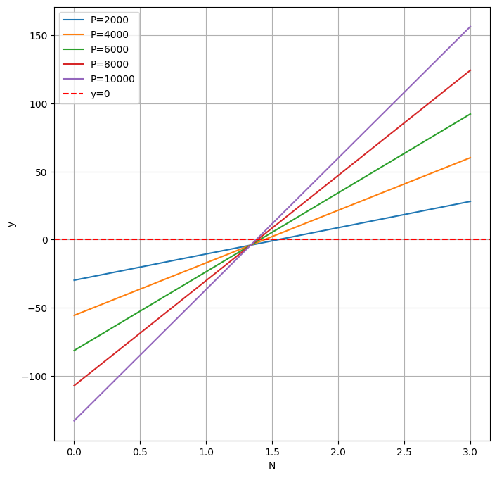
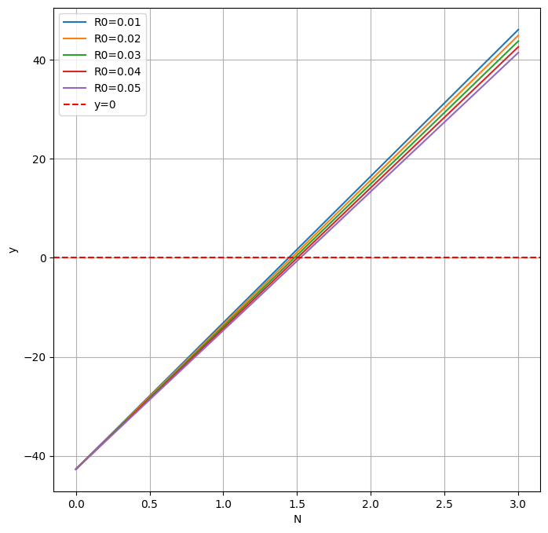
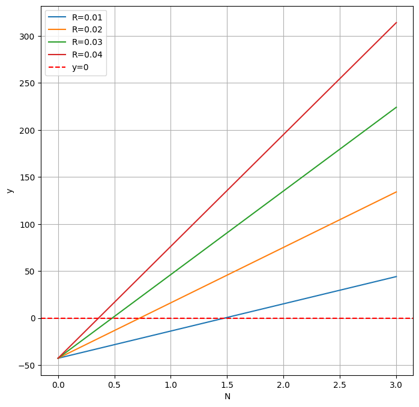
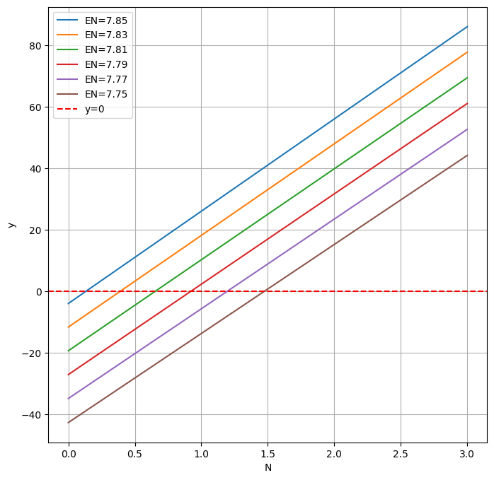

# HKDUSD 利差套利复盘

今天例行看了眼融资利率 5%+，赶紧把套利停了，没想到结束的这么快，出师不利。

这次套利从 2025-08-04 开始，到 2025-08-20 结束，净亏损 $16.51，复盘记录一下。

```
2025-08-04  借入 HK$23644.2 折合 $3012.00 汇率 7.85 手续费 $2
2025-08-20  归还 HK$23644.2 折合 $3027.43 汇率 7.81 手续费 $2

港币利息 HK$21.74 折合 $2.78
美元利息 $5.7

最终损益 (3012 - 3027.43) + (5.7 - 2.78) - 4 
```

损益大头发生在汇率变动，15.43 切身体会 AI 强调的汇率风险。

今年大约 6-7 月份的时候发现港币的定期利率下降了很多，当时感觉很奇怪，作为美元的影子货币，利率居然没有跟着美元走。

问了 AI，这是因为港币余额暴增导致同业拆放利率几乎跌倒 0，那么定期自然也不可能高了，期间还了解到套利交易。

套利交易很简单，就是当 H 货币的贷款利率 < U 货币的存款利率时，可以通过借入 H 货币买 U 货币完成套利。

最典型就是日元/美元，日元长期处于低利率，由此还催生了渡边太太。

考虑到汇率风险（考虑了，但只考虑了一点 /哭笑），我选了港币，因为联系汇率制度的存在，港币只会在 7.75-7.85 之间浮动，不至于太离谱。

接着查了香港同业拆放利率的历史数据，最近的一次低利率是 2020.5 - 2022.6 足足有两年之多，本次刚从 2025.5 月开始，应该稳了。

假设利差 R 低利率货币利率 R0 那么高利率货币利率为 R0 + R

借入汇率 E0 归还汇率 EN，e = E0 / EN，每次转换货币的手续费为 C

本金 P 那么 N 年后收益

y = P + P * (R0 + R) * N - (E0 * P + E0 * P * R0 * N)/EN - 2C

$e' = 1 - e$ 整理后

$$
y = P [N (e'R_0 + R) + e' - 2C / P]
$$

代入我这次的情况 $e' = 1 - 7.85/7.81 = -0.005122$，C = 2，P = 3012，R ≈ 1%，R0 ≈ 2.7%

$$
y = 29.703488 * N - 19.427464
$$

当 N > 0.6540 年时才刚好不赔不亏，大意了。

最差情况 $e' = 1 - 7.85/7.75$，本金和 R0 似乎影响不大，都在 1.5 附近

这是本金的



这是 R0 的



R 的效果比较明显，不过通常利差不会太大



EN 是线性效果，这么来看我选择了非常差的时机



回看历史数据，降到低息的日期是 5.8，而汇率在 5.7 已经开始暴涨，实际好的窗口就 1-2 天。