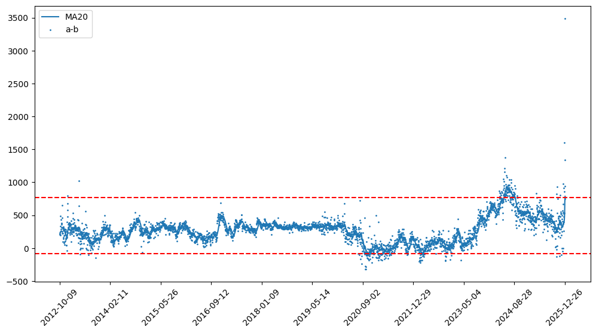
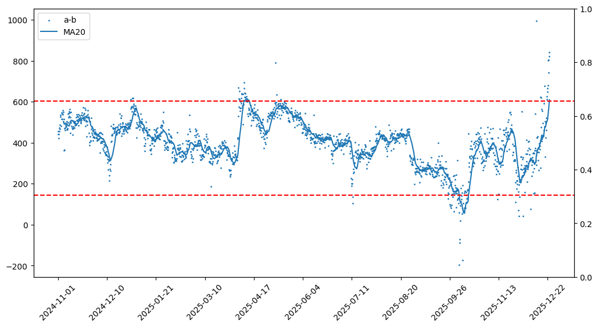

# 白银套利

几天前完成第一笔期货交易，结局很惨，亏了坨大的，小半年白干。

记录一下，警示自己。

12.22 看风叔的文章说国内外铂金市场巨大溢价，于是算了下当时国内外期货的价差，约 ￥95/g，但是广期所的铂金是 11 月才上市的，历史数据不足以计算正常的溢价区间。正准备用铂金现货数据代替，突然发现白银的升水也在扩大。

白银我整理过一些数据：

沪银和 Comex 白银日线相关度

统计周期：2012-10-09 ~ 2025-12-31，其中沪银数据来自东方财富，Comex 白银数据来自 yfinance，汇率数据来自盈透。

相关度：99.39%，95% 价差区间 (-88, 769)，近似 N (272, 211) 的正态分布。

从图中可以看到两个特别明显的高峰，一个是 24 年 5.22 ~ 6.25，一个就是现在。当下可能正在发生和 2024 年 6 月类似的事情。似乎都是价格剧烈波动。

如果统计近两年的数据 2023-01-04 ~ 2025-12-31，95% 区间会非常大 (186, 915) 这是因为刚好包进去两个高峰，所以采样 2024-11-01 ~ 2025-12-23 的数据

相关度：99.84%，95% 区间 (144, 602)

上一次大幅度突破 602 是 2024 年的 1.11 ~ 2.29 和 3.26 ~ 9.6，分别持续 50 天和 165 天，当前这次从 2025-12-22 开始突破，幅度比前 2 次大得多，不知道要持续多少天。

如果按 769 计算，那么区间变为 4.12 ~ 4.19 和 5.20 ~ 8.27，分别持续 8 天和 100 天，当前从 12.23 开始。

如果按 915 计算，那么区间只有一个 5.27 ~ 7.11，持续 46 天，当前从 12.24 开始，才持续 13 天。

标准越高，机会越少，相应的风险也越小。

根据之前的数据，我判断白银的升水大约在 (138, 610) 之间，况且前几个月也只是在 400 附近波动，当天的升水已经到 600 左右了。

第 2 天，升水进一步扩大，突破 800，本来 23 号那天就想做进去，但是当时现金还没有调过来，银行各种限额，不过事后看反而救了我狗命。

第 3 天 24 号，升水扩大至 1000，我顺利入场 AG2602 17378 空单，SIL 72.381 多单，对锁。刚做完单还挺开心的，接着就发现事情不对劲了，升水还在扩大，眼看着它从 1000 逐渐飙升到 1800+，我意识到可能漏观察极值了。

然后我把近 2 年的数据翻出来，但很可惜近 2 年的极值也就在 1000 左右，即便观察到，依然会做单。

之后升水上上下下，始终没有低于 1000，最低的时候是元旦前，事后看这是最佳的止损时机，可惜没把握住，元旦后升水再次飙升，此时已经意识到不对了。

经过一番搜索，有一篇文章用百分比来定义升水，最有可能，11 月以来，白银价格飙升，如果从百分比视角来看，现在的升水可能就是正常的，这是我漏考虑的。

从百分比视角似乎也有道理，无论升水贴水，只要超过一定阈值就会有人愿意把它从一个地方搬运到另一个地方，这个阈值受搬运成本限制，如果包含和商品总价相关的成本，比如税啥的，白银还真有 13% 的增值税，那么当价格暴增时，阈值变大还挺正常的。最差的情况就是阈值上去了下不来，这就非常尴尬了。

从百分比视角再看一遍数据

近 13 年数据，95% 区间 (-1.65%, 13.04%)，近 2 年的数据是 (1.61%, 12.71%)，去掉两个高峰的数据是 (1.16%, 8.17%)，在百分比视角下两个高峰并没有造成太大的影响。

当前最高的时候也不过 12% 多点，这样来看升水的判断真的错了。

意识到和及时止损是两回事，贪婪在此时表现的淋漓尽致，一直用还会回去的麻痹自己。

持仓过程并不好受，白银波动巨大，沪银还好，有涨跌幅限制，算好现金就不会爆仓.但是 Comex 白银没有涨跌幅限制，看过它从 82 直接跌到 71，且可以 23 小时不间断交易，时间极长，每次睡觉醒来，第一眼看一下昨晚行情。这其实已经是赌了，就赌睡觉的时候不会闪崩，如果真发生闪崩，也只能认了。

想睡觉安稳，只能备足市值规模的现金。当然也可以两个账户倒腾现金，但一是有外汇管制，二是银行也不是 24 小时营业，流动性大打折扣。

最好是两个品种都可以用同一个账户交易，这样对锁，浮盈浮亏都在一个账户里，风险就小很多。

终于在 1.16 号，升水再次冲高没能扛住，割肉离场。

那个晚上，莫名的恐惧一直萦绕，无法驱散。在这之前我一直认为我能够做到巴菲特的那句「别人恐惧时我贪婪」实际上只是亏损的金额不够大。

经过这次，我修改交易规则

1. 升贴水超出 95% 区间，同时考虑 10 年和 1 年
2. 观察升贴水百分比分位
3. 观察合约成交量，尤其接近月末，注意主力合约切换
4. 及时止损，比如 2%，事实证明我没有能力判断升贴水合理区间，止损防止操作变形

学无止境，学费也无止境。