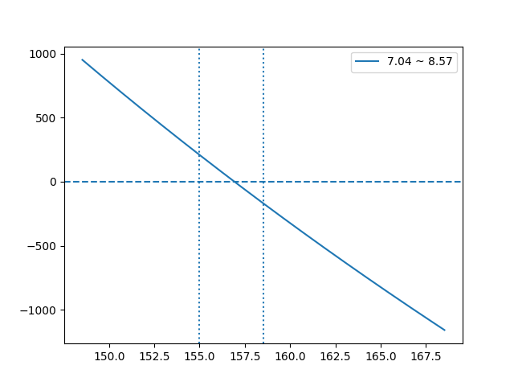
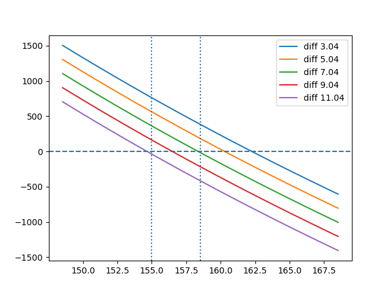

# 套利·二

白银套利失利后，观察到大阪黄金和 Comex 黄金之间似乎也有套利空间，而且这两个品种金额较小，很适合练手

统计最近一年的数据，发现升贴水大概在 -1.1 ~ 3.82 之间，但是最近一段时间都在 5 左右，这又让我犯难了，我都有点怀疑这数据到底有没有参考价值。

最终在 1.23 号以升水 7.04 开仓，因为接下来两天是周末，刚好有事要忙，也就没管它。

然后时间来到 1.26 周一，这天在外面，不能实时看升水，但是发现似乎盈利了，于是果断平仓，粗略算了下大概 100 来块，想着大概是升水回落到 5.5 左右了。

然后诡异的事情发生了，27 号复盘时发现平仓的升水是 8.5，这就很奇怪了，如果升水扩大那应该亏损才对，怎么会盈利呢。

我第一反应是方向做反了，反复检查没反，高做空，低做多。

这就很可怕了，这意味着我套利的逻辑是有问题，既然升水扩大能盈利，那哪天缩小也能让我亏损。

反复检查数据，最可疑的就是汇率了，持仓期间汇率变动很大，从 158 下降到 154。

于是写代码验证了一下

开仓价以实际为准，升水 7.04，平仓价以 Comex 黄金的价格为基准价格，根据汇率计算东京金的价格，升水为 8.57，汇率取 148 ~ 168 得到下面这张图

还真有关系，看起来是条直线，放大汇率后是曲线，正是因为汇率从 158 下降到 154 才让我没亏损。

这就很可怕了，汇率无法预测，且我也没那么多钱对冲汇率，那这个套利还要多一个汇率风险。

而且这个汇率影响还不小

图中升水以 7.04 为中心，缩小到 3.04 已经是极限了，汇率涨到 162 左右就即将亏损。

唯一的办法是让持仓时间尽可能短，这样汇率变动就不会太大了。