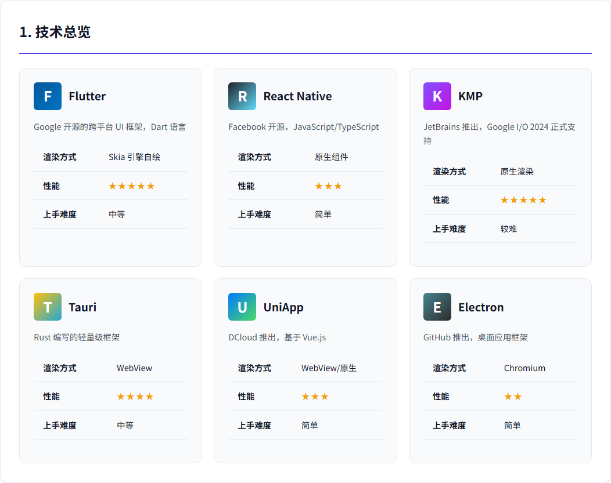
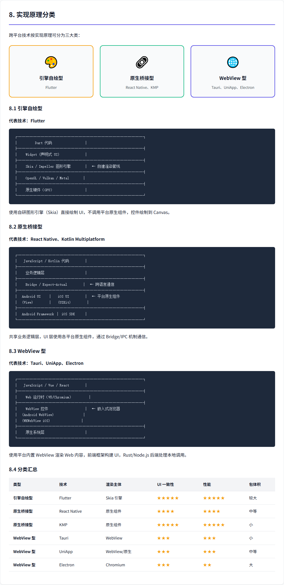
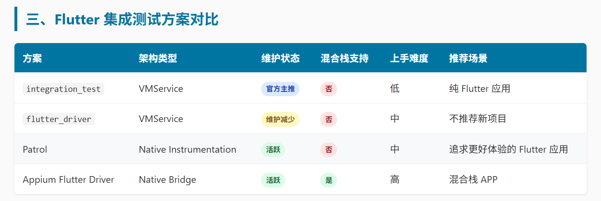

# Claude Code 初体验

Claude Code 出来已经一年多了，作为一个干啥都慢半拍的程序员，决定上手玩一玩。

A 社是个中国黑，它本家模型就不指望了，好在国产大模型追的也猛，就开了个 MiniMax 的 Token Plan，毕竟 M2.7 刚出。

安装没啥大问题，官网好像悄咪咪把 npm 安装移除了，看来愚人节前夜对他们伤害很大。

装好后跟着 MiniMax 的文档 https://platform.minimaxi.com/docs/token-plan/claude-code 配置即可，跳过繁琐的登录流程。

自带的 web_search 和 Fetch 需要开着代理才能用，部分网站似乎还被 A 社拉黑了，坑爹。

恰巧 MiniMax 自带一个网络搜索 MCP，emmm 是不是他们也发现这个问题。

一键安装命令有点问题，在 Windows Terminal 下无法执行，会报 -y 什么什么的，只能手动配置。配置完还不一定连的上，我是开代理后连上的，但连上后关了代理也都正常，不知道啥情况。

对于 App 开发，基本零经验，用 Claude Code 调研了下相关技术栈



根据原理可以分为三类



保守来说应该选 UniApp，前端代码姑且了解过一些，UniApp 也听朋友说起过，还有个伴能问问，但既然是玩，那就玩点激进的。

Flutter 安装没啥大问题，按照官方文档来就是了，真有问题也是网络问题。网络问题可以用终极杀招开 Tun Mode，这样所有流量都走代理，如果这招也搞不定，那只有烧香了。

需要注意验证下 Tun Mode 是否开启成功，以 google.com 为例，开启前必须打不开，开启后必须能打开。

有些代理软件，比如我用的黑色猫猫头，每次打开 Tun Mode，要点一下扳手，安装服务，才能真正启用，被它套路过一次。

装完最好装一下 Android Studio，主要是为了 SDK，Android Studio 可以设置代理，第一次装要下载不少东西。

再就是设备，电脑够猛的可以上模拟器，我电脑太烂，出风口可以把鸡蛋吹的比刚出锅还烫，翻出来一台远古 MI 8 SE 当真机。

连上数据线，执行命令

```
adb tcpip 5555
adb connect 192.168.31.115:5555
```

可以开启无线调试，这时候拔掉数据线也无所谓，用命令 `adb devices` 能看到设备还在。

无线调试还有个好处，没啥幺蛾子，USB 调试安装 apk，各种失败，这了那了，无线屁事没有。

然后是决定做什么，这个问题对码农挺难的。

想到老爹最近沉迷短剧，那要不做个短剧 app 吧，随便下了个，截了五张图，然后输入

```
@Screenshot\\ 这个文件夹保存红果免费短剧 app 的截图，现在需要你根据截图，开发一个仿红果免费短剧 app
```

这一步非常惊艳，截图的内容还原了七八成出来。开发播放功能也很顺利，很快就可以播放了。

随着开发上滑功能，好运到此结束。

首先遇到的是怎么滑都没反应，为了确定问题又是打印索引，又是显示滑动距离，都没用。

这期间 AI 改，我测，终于某一次时间线变动了，它发现原因是手势冲突，说什么 SurfaceView 这了那了，也不是很懂，但改完后有反应了。

随之发现另一个问题，我放了 3 集测试数据，它只会在 1,2 集切换，逆天啊，咋想法这么多捏。

然后又是无尽的循环，猛然发觉，不对啊，为啥我要自己测，它测不行嘛。

于是让它自己写单元测试。好嘛，单元测试全过，问题一个没解决，这么玩是吧。。。

那必须得给它上集成测试，让它调研方案



它管这种叫 E2E 测试，又学到个新知识，根据它的报告 Patrol 看着不错，即是本家 integration_test 的增强，底层用的是原生，一股强者的气息。

咔咔咔就整出来三个集成用例，看着有模有样

|#|用例名称|测试内容|
|--|--|--|
| 1  | home page swipe up changes to next episode | 向上滑动从第1集切换到第2集|
| 2  | home page swipe down from episode 2 goes back to episode 1 | 向下滑动从第2集返回第1集|
| 3  | home page swipe up twice reaches last episode | 连续上滑两次到达第3集 |

这次它开始自循环了，改完，运行用例验证，我看着它安装 app，模拟滑动，滑不到第 3 集，继续改，继续验证。

于是我刷 B 站去了。

最后一次看它，已经跑了四个多小时，问题依然没有解决，我也不知道它能不能解决。

有一点可以确认，就算 M2.7 不能解决，还有 Opus 4.6，4.6 不行未来还会有 4.7，4.8。

硅基生命，恐怖如斯。