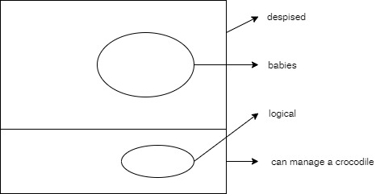

Let P(x), Q(x), R(x), and S(x) be the statements "x is a baby," "x is logical," "x is able to manage a crocodile," and "x is despised," respectively. Suppose that the domain consists all people. Express each of these statements using quantifiers; logical connectives; and P(x), Q(x), R(x), and S(x).

1. Babies are illogical.
2. Nobody is despised who can manage a crocodile.
3. Illogical persions are despised.
4. Babies cannot manage crocodiles.
5. Does (d) follow form (a), (b), and (c)? If not, is there a correct conclusition?

1. $$\forall x (P(x) \rightarrow \neg Q(x))$$
2. $$\neg \exist x (S(x) \wedge R(x))$$
3. $$\forall x (\neg Q(x) \rightarrow S(x))$$
4. $$\forall x (P(x) \rightarrow \neg R(x))$$
5. Yes

e. 

